# ベース・レジストリとしての住所・所在地マスターデータ整備について

> 2021年5月 政府CIO補佐官（中村弘太郎・下山紗代子・関治之・平本健二）によるディスカッションペーパー。内閣官房IT総合戦略室／政府の公式見解を示すものではない。ローカルの dp2021_03.docx を pandoc で変換（表紙・目次を除去、見出しを1段下げ、テーブルを整形、図は省略）。ABRの基礎となった検討資料。

## はじめに

### 背景と目的

「ベース・レジストリとは、公的機関等で登録・公開され、様々な場面で参照される、人、法人、土地、建物、資格等の社会の基本データ」であり、正確性や最新性が確保された社会の基幹となるデータベースである。日本ではいくつかの台帳等が相当する。ベース・レジストリは行政サービスの改善に必須の要素である。デジタル手続法[^1]により、ワンスオンリー[^2]、ワンストップ処理が求められているが、その実現にはデータの標準化とベース・レジストリの整備が必要となる。ベース・レジストリは、社会全体で広範に使われる公的機関等で共有される基本データである。マスターデータの一種だが、公的に権威があり、広く社会的に使われるものである。戸籍のように行政機関を中心に参照されるものと、郵便番号のように広くオープンデータとして公開されるものがある。

住所・所在地のマスターデータは、人（個人）や法人とともにあらゆる社会活動の土台となる基礎的なベース・レジストリであり、デジタル先進国においても先行的に整備されている。

しかしながら日本では、住所・所在地の情報は市区町村や登記所で個別に管理されており、標準的な住所・所在地を一元的に管理できていない。加えて、一般に流通している住所・所在地の表記は、地域により様々に異なり、特殊なケースも多々存在している。

本ディスカッションペーパーは、デジタル社会の実現ならびに行政のデジタル化に資するよう、住所・所在地の情報をベース・レジストリとして整備・更新するために考慮・検討すべき事項を整理するものである。

### 用語

本ディスカッションペーパーにおいて使用する用語は、表 １‑1 のとおりである。

表 １‑1　用語の定義

| 用語 | 意味 |
|---|---|
| ベース・レジストリ | 公的機関等が保有する社会の基本データ（個人、法人、土地、建物、資格等に関するデータ）を登録したデータベース。社会の基盤として、データの正確性や最新性を確保するなど、行政手続をはじめとする様々な場面で参照し得るよう整備することが求められるもの。 |
| 町字／町字レベル | 市区町村の下層の行政区画は、地方自治法（昭和22年法律第67号）や住居表示に関する法律(昭和37年法律第119 号)で「町若しくは字」「町又は字」と表されているが、本書では「町字（まちあざ）」と表現する。「町」「丁目」「大字」「（小）字」など。 （詳細は付属資料２（１０.１）にも記載。） |
| 番地号／番地号レベル | 町字の下層の住所・所在地や土地を特定するために用いられる、「地番」や住居表示における「街区符号」「住居番号」について、本書では総称して「番地号」と表現する。 |
| 地番 | 不動産登記法(平成16年法律第123号)で規定される、一筆の土地ごとに付す番号。住居表示を実施していない区域においては、住所・所在地の表示にも利用される。 （詳細は付属資料２（１０.２）にも記載。） |
| 住居表示 | 住居表示に関する法律で規定される、市街地の住所・所在地の表示。街区方式と道路方式がある。住居表示が実施されている区域においても、別途地番は存在する。同じ場所を示す2種類の方法が存在することになる。 （詳細は付属資料２（１０.１）にも記載。） |
| 位置参照情報 | 場所を識別するためのラベル（地理識別子）である住所・所在地の実世界における位置を緯度・経度や平面直角座標等により記述（空間参照）する情報。国土交通省が、「街区レベル位置参照情報」「大字・町丁目レベル位置参照情報」を提供している。 |
| 代表点 | 住所・所在地が示す場所を代表する点。位置参照情報として、代表点の座標を整備するのがひとつの方法。 |
| ポリゴン | 地物の領域を二次元の多角形の面として表現したもの。住所・所在地の場合、その住所・所在地が示す領域を示し、構成点の座標を整備することにより実世界における位置を記述する。 |

## 海外の先進事例

海外でベース・レジストリに取り組むときに最初に取り組まれるのがアドレスデータである。個人情報を含まず、経済的波及範囲が大きいことから、先行して整備が行われる。国内は区画で住所・所在地を表し、海外のストリート型のアドレスとは異なる方式をとる等、アドレス情報の仕組みは違うが収集やデータベース化、効果評価等が参考になる。

### デンマーク[^3]

> 1990年に、アドレスデータは全ての分野やアプリケーションの共通データとして重要であることからデータ化を開始した。1996-2001年に、自治体のボランタリな作業としてジオコーディングを実施し全国の97%のアドレスを特定した。
>
> 

図 １‑1-1　アドレスデータの例3

> 2000年に、アドレス情報は国のベース・レジストリに位置づけられ、2002年に、国と自治体で、自治体のアドレスデータは無料で公開することのアグリーメントを締結した。またそれに伴い、整備のために4年間の財政支援を自治体に対して実施した。現在は、OSM（オープン・ストリート・マップ）と連携し、データ活用してもらうとともに、データの間違いの報告をしてもらい、アドレスデータに反映している。
>
> オープンデータにしているので、行政機関だけではなく民間企業も活用しており、現在は利用の70%が自治体からのアクセスとなっている。
>
> 

図1-2　アドレスデータの利用状況3

> <u>行政機関における効果</u>

- アドレス情報管理時間の削減

- 様々なデータソースの情報における、アドレス情報の整合性を確保するための時間の削減

> <u>企業における効果</u>

- 高い正確性で、全国がカバーされ、最新のデータを入手できる

- アドレス情報を購入する費用がなくなり、データを使ったサービスを改善できる

> <u>市民における効果</u>

- アドレスデータが間違っていた時に生じる可能性のある不利益に対する心配がなくなった

> 1つのデータベースを整備したことにより、1000のアプリケーションが開発され、500万人のユーザーが利用している。この経済的価値は大きい。初期フェーズでの投資対効果は、整備運用費3.5億円（€2.8m (2003-2010) ）に対して、経済効果が96億円（€77m (2005-2010) ）と試算されている。また、2015年以降の経済効果は、初期投資15億円、運用投資5億円に対し、年間40億円の価値と試算されている。（€1=125、常勤職員1名のコスト1000万円で計算）
>
> 

図 1-3　アドレスデータの投資対効果3

> アドレスデータ・ベース・レジストリの企画、運営をするために、住宅・都市・地方大臣が議長となる委員会を設置している。参加組織は、地理空間庁、自治体（複数）、人口登録センター、法人登記機関、税機関、デジタル庁であり、アドレスデータ管理のためのプログラム・マネージャを設置している。
>
> 利用しやすいようにDanish Address Web API(DAWA)を提供し、最新のアドレス情報が誰でも取得可能になっている。Addresses, road names, road sections, additional city names and postal codes等だけでなく、地理座標やポリゴンも含まれる。単にアドレス検索によるデータ提供だけではなく、アドレスデータクレンジング、自動入力支援、地図上のポイントからのアドレス取得などの機能を提供している。
>
> 

図 1-4　アドレスデータAPIのDAWA[^4]

### エストニア

> 地理空間情報の利用は行政サービスの本質的サービスと位置づけている。その中でもアドレスデータを最重要のデータに位置づけている。自治体がデータの正確性と品質を保証し、すべてのアドレスデータはAddress Data System (ADS)に登録される。このアドレスデータは、オープンデータになるだけではなく、その他のデータセットのメンテナンスに使われる。
>
> アドレスシステムは、アドレスの規格（形式、構成要素及びフォーマット）や管理方法を統一し、対象物に対して、表記上のアドレス情報（家屋番号、通り名、都市名及び郵便番号）と地理的情報（点や範囲）と各種登録コード（土地台帳、地籍台帳及び建築登録簿）を結び付けている。また旧アドレスにも対応している。ADSは、APIであるIn-ADSを通じてオープンにアクセスが可能である。
>
> 政府のLand Boardがこのデータベースを管理、運営している。また、単にアドレスを参照するだけでなく、全ての政府機関は、アドレスを扱うときに、このデータベースを利用しなければならないと決まっている。

### 英国

> 2014年に政府の独立レポートとして「An open national address gazetteer」が公表され、アドレスデータを自由に利用、再利用ができる国の資産と位置づけている。経済的社会的効果が、コストに対して遥かに大きいと考えている。一方、品質、維持、取引、法、財務上の解決すべき課題があると認識されている。
>
> <https://assets.publishing.service.gov.uk/government/uploads/system/uploads/attachment_data/file/274979/bis-14-513-open-national-address-gazetteer.pdf>
>
> 現在は、国の呼びかけで作られたジョイントベンチャーのgeoplace社がNational Address Gazetteerの運営を行っており、528組織から情報を収集し6週間ごとにデータ更新をしている。
>
> 2020年７月からは、Unique Property Reference Numbers(UPRNs)とUnique Street Reference Numbers(USRNs)をオープンデータとして公開し、行政の効率化とともに、社会全体の効率化を図っている。また、高度な情報やサービスは有料で販売している。
>
> 

図 1-5　アドレス情報の例

> <https://www.geoplace.co.uk/>
>
> これらの取り組みによる投資対効果の試算をしている。効果モデルを元に効果を算出し、整備費と比較している。2020年までに４倍の投資対効果と計算している。[^5]
>
> 

図 1-6　投資効果の分類5

> 

図 1-7　投資対効果の試算5

### 米国[^6]

> 運輸省がNational Address Database（NAD）に取り組んでいる。輸送のために作っているが、郵送、許認可、教育などの様々な行政サービスの本質的な基盤と捉えている。国と自治体が協力して取り組みを進めているが、24州が参加し、現在進行中である。
>
> 

図 1-8　アドレスデータベースの進捗（2020-09）

> 詳細なデータ構造定義を行っており、下記のように統一はされていないが様々なイメージで詳細図まで管理できる。
>
> 

図 1-9　アドレスイメージの例

> NADを構築運用するための役割分担は以下のように整理されている。
>
> 

図 1-10　アドレスデータの運用体制と役割

## データ標準化に向けたこれまでの取組

### 行政基本情報データ連携モデル

行政のサービス・業務改革に伴う政府情報システムの整備及び管理について、その手順や各組織の役割等を定める体系的な政府共通ルールである「デジタル・ガバメント推進標準ガイドライン」及びこれに関連する指針類等に係る文書体系である「標準ガイドライン群」が政府CIOポータルに公開されている。

標準ガイドライン群

<https://cio.go.jp/guides>

標準ガイドライン群に含まれる「行政基本情報データ連携モデル（略称：行政データ連携標準）」は、日付時刻、住所、電話番号等、手続や情報提供において分野を問わず使用される基本的なデータの形式について、データ連携を円滑に行えるよう、基本的なデータの記述形式を示したモデルである。

住所のデータ記述形式は、住所関連の主要省庁及び日本郵便株式会社のデータ記述方式を参照し、場合に応じた記述形式が決められている。

行政データ連携標準　住所

<https://cio.go.jp/sites/default/files/uploads/documents/1015-2_gyousei_data_model_address.pdf>

（2019年3月28日　初版決定）

なお、この中で、町字に関して以下のように記載されている。

> ２.３　町字識別子を使用して管理する場合（現在検討中）
> 町字まで識別子で管理し、番地以下をデータで持つ。
> 例）東京都千代田区霞が関二丁目１番6号の場合
> データ「（町字識別子）」「1-6」
> 表記「東京都千代田区霞が関2-1-6」

> ６　町字識別子の整備
> 住所表記の揺らぎがあった場合に正確な表記が可能となるように、国が中心となり最新の町字情報が一覧できる環境を整備することとする。
> 町字識別子には、ID、漢字名、カナ名、英字名、ポリゴン情報を含む。

### 共通語彙基盤（IMI情報共有基盤）

IMI(Infrastructure for Multilayer Interoperability:情報共有基盤)は、経済構造革新への基盤づくりの一環で、データに用いる文字や用語を共通化し、情報の共有や活用を円滑に行うための基盤である。共通語彙基盤と文字情報基盤により、行政サービスの相互運用性(Interoperability)向上を図っている。

共通語彙基盤は、データで用いる様々な用語の表記、意味、構造を統一し、分野を超えてデータの検索向上やシステム連携強化を実現する。

共通語彙基盤

<https://imi.go.jp/goi/>

コア語彙は、共通語彙基盤の基礎をなすもので、氏名、住所、組織等、あらゆる社会活動で使用される中核的な用語の集合である。多くのシステム間で情報交換のための基礎となる語彙で、データ交換、オープンデータの二次利用等の効率化に役立つ。

コア語彙 バージョン2.4.2

<https://imi.go.jp/core/core242/>

（2019年２月公開）

コア語彙のひとつとして、住所型、住所DMDが公開されている。

住所型

<https://imi.go.jp/ns/core/Core242.html#ic:%E4%BD%8F%E6%89%80%E5%9E%8B>

住所DMD

<https://imi.go.jp/dmd/0000009/>

## 行政が整備・提供するデータ（住所・所在地関連）

### 全国地方公共団体コード（総務省）

都道府県コード及び市区町村コードをPDFファイル及びExcelファイルで提供している。また、2005年４月１日以降の変更情報の提供もされている。

全国地方公共団体コード

<https://www.soumu.go.jp/denshijiti/code.html>

### 位置参照情報（国土交通省）

大字・町丁目レベル位置参照情報及び街区レベル位置参照情報をCSV形式のファイルで提供している。それぞれ、全国の大字・町丁目の代表点の位置座標（緯度・経度、平面直角座標）、街区（全国の都市計画区域相当範囲が対象）の代表点の位置座標を整備したものである。年１回の更新。

GISホームページ（国土数値情報、位置参照情報ほか）

<https://nlftp.mlit.go.jp/index.html>

### 電子国土基本図（地名情報）（国土地理院）

電子国土基本図（地名情報）は、「オルソ画像」「地図情報」とともに、デジタルデータを中心とした新たな基本図体系の一つとして、地図等により国土を表す基準となるものである。測量法（昭和24年法律第188号）に基づく基本測量の成果であり、国土地理院が同法第13条に基づき地方公共団体から資料又は報告の提出を求め、整備・更新を行っている。

#### 電子国土基本図（地名情報）

数値地図（国土基本情報）として、地図情報、メッシュ標高情報、付属情報とともに地名情報として提供されており、居住地名、自然地名、公共施設、信号交差点のデータが含まれる。

電子国土基本図（地名情報）

<https://www.gsi.go.jp/kihonjohochousa/chimeijoho.html>

#### 電子国土基本図（地名情報）「住居表示住所」

住居表示実施区域の住居番号を決める際に用いる「基礎番号」の代表点の位置座標（緯度・経度）をCSV形式のファイルで提供している。

電子国土基本図（地名情報）「住居表示住所」

<https://www.gsi.go.jp/kihonjohochousa/jukyo_jusho.html>

### 国勢調査 小地域（町丁・字等別）境界データ（総務省統計局）

e-STATでは各種統計データを地図上に表示し、視覚的に統計を把握できる地理情報システム（GIS）を提供しており、地図で見る統計（jSTAT MAP）に登録されている境界データ（ポリゴンデータ）を各種GISフォーマット（Shapefile、KML、GML）で提供している。５年ごとに実施される国勢調査のデータが提供される際に提供される。

e-Stat 地図で見る統計（統計GIS）境界データ

<https://www.e-stat.go.jp/gis/statmap-search?page=1&type=2>

### 特徴比較

上記のうち３データについて特徴を比較したものが 表 ３‑1である。

表 ３‑1　各データの特徴比較

|  | 国勢調査 小地域 （総務省統計局） | 位置参照情報 （国土交通省） | 住居表示住所 （国土地理院） |
|---|---|---|---|
| 範囲 | 全国 | 全国 街区レベルは都市計画区域相当範囲のみ | 全国 住居表示実施区域のみ |
| 階層 | 大字・町丁目レベル相当 | 大字・町丁目レベル 街区レベル | 住居番号レベル |
| レコード単位 | 統計情報を集計することを目的とした単位（例えば、大字を複数の小字で構成されるいくつかの単位に分割しているケースがある） | 大字・町丁目レベル位置参照情報は一定の網羅性のあるマスターデータ的な整備 街区レベル位置参照情報は街区（住居表示未実施区域を含む）の単位（非網羅的に小字の名称の収録がある） | 住居表示の住居番号の基礎番号単位（実際の住居番号は住居ごとに設定されるため異なる） |
| コード化 | コード化されている(統計集計単位) | 大字・町丁目レベル位置参照情報のみコード化されている | コード化されている（URI形式） |
| 位置座標 | 大字・町丁目レベル相当のポリゴンデータ | 大字・町丁目レベル、街区レベルそれそれの代表点 | 住居番号の基礎番号の代表点 |
| 読み仮名等 | 読み仮名・英語表記の収録がない | 読み仮名・英語表記の収録がない | なし（基本的に数字） |

## ベース・レジストリとしての住所・所在地マスターデータの位置付け

### 既存の住所・所在地関連オープンデータの課題

行政が提供する既存の住所・所在地関連オープンデータには、ベース・レジストリに求められる正確性や最新性の確保の観点で以下のような課題がある。

- 更新頻度が年１回または５年に１回。

- 調査時点から提供時期までに要する期間が長い。

- 標準的な住所・所在地は一元的に管理されておらず、解釈の違いが生じ、既存データ間で対応が取れない場合がある。

- 個別にコード化されているものの、共通のIDがない。

例えば、位置参照情報の説明には以下のような記述がある。

> *街区レベル位置参照情報に含まれる地名は、市町村資料、国土地理院の数値地図2500、民間の地図等を基に作成したものであり、国内の標準的な地名を指定しているものではありません。*

（<https://nlftp.mlit.go.jp/isj/index.html>）

このような状況の背景として、以下が挙げられる。

- 地方自治法等の法律において、町字の明確な定義がない。

- 同法第260条に基づく、町字の区域・名称の新設・廃止・変更の業務は個々の市区町村が実施し、告示義務があるものの、その情報公開の方法等が様々に異なる。よって情報・資料の集約に労力がかかる。

- 住居表示に関する法律に基づく、住居表示の実施や、実施済み区域内の街区・住居番号の変更等の業務は個々の市区町村が実施し、告示義務があるものの、その情報公開の方法等が様々に異なる。よって情報・資料の集約に労力がかかる。

- 不動産登記法に基づく、土地の登記における地番に変化が生じる登記（新たに生じた土地等の表題登記、土地の滅失、分筆、合筆等）の業務は個々の登記所が実施するが、広く一般に情報公開はされない。よって情報・資料の集約に労力がかかる。

- 一般に流通している住所・所在地の表記は、地域により様々に異なり、特殊なケースも多々存在している。

### ベース・レジストリとしての要件

既存の住所・所在地関連オープンデータの課題を解消し、住所・所在地のマスターデータがベース・レジストリとして最大の効果を生むための要件を以下に示す。

- 国がオーソライズしている住所・所在地のマスターデータが存在する。

- 住所・所在地マスターデータは、継承性のある固有のIDを持つ。

- 住所・所在地マスターデータは、オープンデータ及びAPIとして無料で提供され、行政のみならず誰もが広く利活用できる。

- 住所・所在地マスターデータを利用した住所正規化ツールがオープンソースで提供され、行政のみならず誰もが広く利活用できる。

- 住所・所在地マスターデータは、再利用可能な高い品質で維持され、変化情報も遅滞なく収録・提供される。

- 住所・所在地マスターデータは、国及び自治体の各種台帳や行政サービスからデータ連携の形で参照される。

また、一体的に以下が実現することが望ましいと考えられる。

- 住所・所在地の情報を管理する市区町村や登記所の業務がデジタル化かつ標準化され、自ずと機械判読可能な品質のデータを出力できる。

- 住所・所在地マスターデータを更新する必要のある変化が生じた場合は、市区町村や登記所から、能動的に標準化された形式でデータ、情報、資料が開示されるWebサイト等の場が用意される。

- これにより、国が整備・提供する既存の住所・所在地関連オープンデータ（位置参照情報や国勢調査小地域等）の更新に必要な情報・資料の収集のコスト・時間が大幅に低減する。

### ベース・レジストリとしての住所・所在地マスターデータの位置付け

既存のオープンデータを活かしつつ、現状の課題を解決するための、ベース・レジストリとしての住所・所在地マスターデータの位置付けは、以下のように考えられる。

- 町字レベルのマスターデータに関しては、その収録内容を各市区町村により公式のものと認定されたものであること。

- 広く一般に利用可能な状態で公開されること。

- 住所・所在地マスターデータは、国の既存の各種オープンデータ（位置参照情報・国勢調査データ等）の機能を代替するものではなく、共存し、連携するものとする。但し、将来的な機能の統合を否定するものではない。

ベース・レジストリとしての住所・所在地マスターデータは、町字レベルにおいては国内の標準的な地名（町字、さらには通称名）をオーソライズしていくことを目指すものである。

初期の段階では、既存の位置参照情報や小地域境界データとは併存し、連携する形を考えている。

例えば、位置参照の機能である代表点緯度経度座標の整備は、位置参照情報に委ね、住所・所在地マスターデータには代表点座標を保持せず、位置参照情報へのIDによるリンク情報を保持することにより、データ連携を可能とする。

図 ４‑1住所・所在地マスターデータ関連データ等の関係

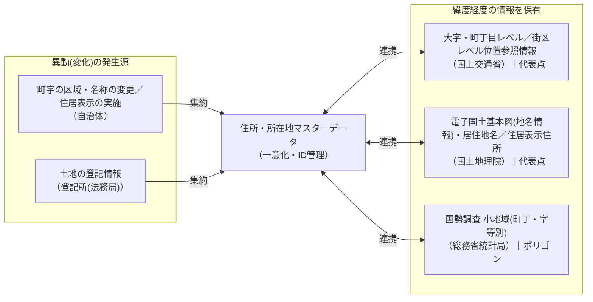

> ※上図は dp2021 図4-1 の再現。自治体・登記所で生じる異動を集約して住所・所在地マスターデータに一意化・ID管理し、位置参照情報・電子国土基本図・国勢調査小地域と連携（代表点・ポリゴン等を保有）する関係を示す。

より具体的には、ID対応表を介して既存データとリンクする図 ４‑2のような構成案が考えられる。

図 ４‑2　ベース・レジストリとしての住所・所在地マスターデータ構成案

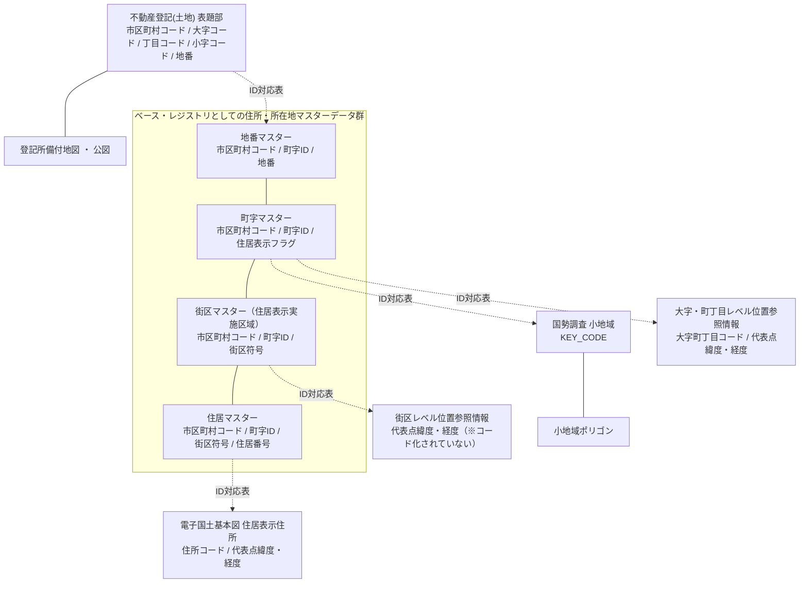

> ※上図は dp2021 図4-2「構成案」の再現。ABRの各マスター（地番／町字／街区／住居）は町字ID・街区符号等で相互に連結し、ID対応表を介して既存オープンデータ（大字・町丁目／街区レベル位置参照情報・国勢調査小地域・電子国土基本図住居表示住所）および不動産登記とリンクする。

### 住所・所在地情報の出所

住所・所在地の情報は、概ね行政機関において生じるものであり、所掌の行政機関が組織内部に留めず広くオープン化することが求められる。

#### 町字（市区町村）

> 町字の区域の新設・廃止、町字の区域・名称の変更は、地方自治法第260条に基づき市町村（特別区を含む。）が実施する。主な発生事由は以下の通り。

- 土地改良事業

- 土地区画整理事業

- 国土調査の実施

- 新たに生じた土地

- 住居表示の実施

- 町界町名地番整理の実施

- 大規模な宅地造成

- その他

#### 住居表示（市区町村）

> 住居表示は、住居表示に関する法律に基づき市町村（特別区を含む。）が実施する。

#### 地番（登記所）

> 地番の新設・廃止・変更は、不動産登記法に基づき登記所が表示に関する登記を行うことにより生じる。主な発生事由は以下のとおり。
>
> （申請に基づく登記）　※地番の変更に関わるもの

- 表題登記（新たに生じた土地や表題登記がない土地の所有権の取得）

- 分筆

- 合筆

- 土地の滅失

- その他

> （職権による登記）　※地番の変更に関わるもの

- 一筆の土地の一部の地目・地番区域の変更による分筆

- 地図の作成に必要となる分筆・合筆

- その他

> 登記記録は以下のような項目があるが、住所・所在地の情報として必要となるのはそのうちの一部である。

| 登記記録 |            |                  | 住所・所在地での要否 |       |
|----------|------------|------------------|----------------------|-------|
| 表題部   | 地図番号   |                  | ○                    | (\*1) |
|          | 土地の表示 | 不動産番号       | ※                    |       |
|          |            | 所在             | ○                    | (\*2) |
|          |            | 地番             | ○                    |       |
|          |            | 地目             |                      |       |
|          |            | 地積             |                      |       |
|          |            | 原因及びその日付 | ※                    |       |
|          |            | 登記の日付       | ※                    |       |
|          | 所有者     |                  |                      |       |
| 権利部   | 甲区       |                  |                      |       |
|          | 乙区       |                  |                      |       |

> ○：情報として必要、※：データ管理上必要
>
> (\*1) 代表点やポリゴンの整備には地図自体が必要となる。
>
> (\*2) 地番を特定するために、市区町村・町字の情報が必要となる。

### 整備レベル

住所・所在地の整備レベルは、複数の観点で以下のように整理することができる。段階を踏んで整備を進めることも考えられる。

#### 行政区画に関する整備レベル

| 整備レベル | 整備内容 | 備考 |
|---|---|---|
| 1 | 町字 |  |
| 2 | 町字＋住居表示の街区 |  |
| 3 | 町字 ＋住居表示の街区・住居番号(*1) ＋住居表示非実施区域の地番 | 住所・所在地としての表示を網羅できる |
| 4 | 町字 ＋住居表示の街区・住居番号 ＋すべての地番 | 住居表示実施区域の不動産登記の地番まで網羅できる |

> (\*1) 住居番号はフロンテージの基礎番号を整備する場合と、実際の建物等につけられた住居番号を整備する場合の２とおりある。前者の例として、国土地理院の電子国土基本図（地名情報）「住居表示住所」がある。

#### 情報の深さに関する整備レベル

| 整備レベル | 整備内容 | 備考 |
|---|---|---|
| 1 | 行政区画のID＋名称 | 最低限の定義がなされたマスターデータ |
| 2 | 行政区画のID＋名称 ＋ヨミガナ・英字等の属性 | 様々な利用シーンに対応したマスターデータ |
| 3 | 行政区画のID＋名称 ＋ヨミガナ・英字等の属性 ＋代表点座標(緯度経度) | 位置参照情報まで含む |
| 4 | 行政区画のID＋名称 ＋ヨミガナ・英字等の属性 ＋代表点座標(緯度経度) ＋区域を表現するポリゴン(＊2) | 地理的範囲の情報まで含む |

> (\*2) 座標（緯度経度）の情報を持つ点により構成される多角形の図形。整備に使用する基図（ベースとなる地図）の縮尺により精度が異なる。

#### 更新頻度に関する整備レベル

| 整備レベル | 整備内容                            | 備考                                   |
|------------|-------------------------------------|----------------------------------------|
| 1          | 年1回の更新                         |                                        |
| 2          | 3ヶ月に1回の更新                    |                                        |
| 3          | 月1回の更新                         |                                        |
| 4          | 実施日に更新                        | 行政サービスでの利用時に差異が生じない |
| 5          | 実施日に更新かつ過去情報を保持(\*3) | 過去のある時点のマスターを再現できる   |

> (\*3)　過去情報は新設日と廃止日を管理することになる。

## 住所・所在地マスターデータ＜町字レベル＞

### 住所のデータ表現における町字の整理

２.１でも紹介した「行政基本情報データ連携モデル 住所」（2019年3月初版決定）に記載されている解説を引用する。

> 住所は、「都道府県」「支庁」「郡」「市区町村」「政令指定都市」「区」「町村」「町・大字」「丁目・字」「番地・号」、「地域自治区」で構成され、さらに「方書」を使用する。
> ※地方自治法（昭和22年法律第67号）第260条に「字」の新設や廃止に関する条項があるが字の定義はない。住居表示に関する法律においても字の定義はない。
> ※本標準では、以下の理由により「町」「大字」「丁目」「字」を分け、「大字」には「丁目」が入らない整理とする。
> ・地方自治法第260条に基づく告示の変更調書で、「○○二丁目」のような新住所表示を大字として表すことがある。
> ・地方公共団体情報システム機構が提供する全国・町字ファイルにおいて「市区郡町村名」に次の項目は「大字、通称名」であり、その次が「字・丁目」である。
> ・「丁目」が「大字」に入る場合と「字」に入る場合の2つの場合があり、コンピュータ処理上、分ける必要がある。

#### 住所の構造（図）

> 出典: 行政基本情報データ連携モデル 住所（2019年3月初版）／資料: 今尾啓介「番地の謎」光文社2017 を基にした構造図の再現。

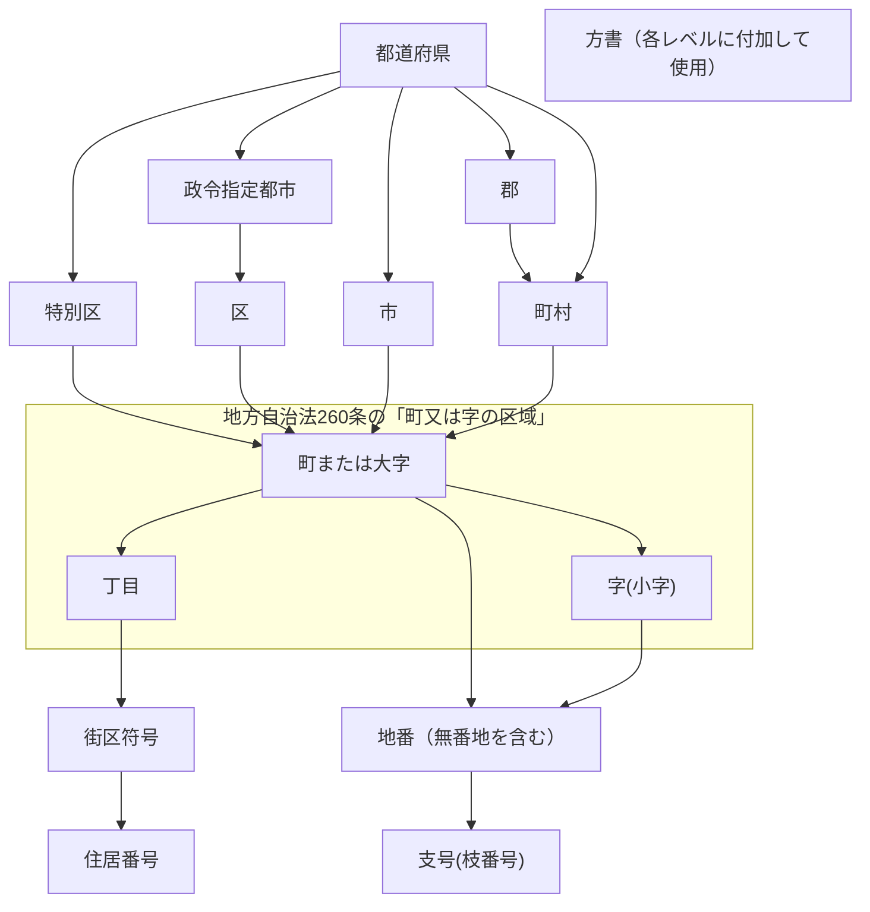

> 補足: 「特別区／政令指定都市の区／市／町村」の下に「町または大字」が付く。「町または大字」「丁目」「字(小字)」のまとまりが地方自治法260条の「町又は字の区域」。市区町村に所属しない土地、大字に所属しない土地も存在する。

市区町村の下層の行政区画として、地方自治法に「町若しくは字」、住居表示に関する法律に「町又は字」と表現されているが、地方自治法にも住居表示に関する法律にもこれら町字の定義は存在しない。（なお、本書では、「町若しくは字」あるいは「町又は字」のことを「町字」と表現する。）

定義がないことにも起因し、一般に流通している各種住所データの項目の分け方・持ち方は統一されておらず、データ間連携を難しくしている。町字を２階層に分けてコード化しているケースが主流だが、この２階層の分け方がまちまちなのである。

### 町字レベル住所・所在地マスターのID体系・データ項目の検討

ベース・レジストリとしての住所・所在地マスターデータ＜町字レベル＞（以降、場合により「町字レベル住所・所在地マスター（データ）」または「町字マスター（データ）」と表現する）において、町字レベルのID体系は２階層構造を採用し、以下の分け方を標準とする。町字を識別するID（「町字ID」と称す）は上位階層の市区町村内でユニークになるよう付番するものとし、階層1を数字４桁、階層２を数字３桁とする。

表 ５‑1　町字の階層

| 住居表示 | 大字・町（階層1） | 丁目（階層2） | 小字（階層2） | 備考 |
|---|---|---|---|---|
| 住居表示実施（街区方式） | 町 | (丁目なし) | － |  |
| 住居表示実施（街区方式） | 町 | 丁目 | － | 堺市の「丁」を含む |
| 住居表示実施（街区方式） | 町 | － | 丁目に文字 | 「●丁目北」など文字を含む場合 |
| 住居表示実施（街区方式） | (町なし) | 丁目 | － | 例外的、固有地名部分がない場合 |
| 住居表示実施（道路方式） | 道路 | (丁目なし) | － | 道路方式の住居表示の場合、道路名は「大字・町名」に収録 |
| 住居表示実施（道路方式） | 道路 | 丁目 | － |  |
| 住居表示非実施 | 大字・町 | (丁目なし) | (小字なし) |  |
| 住居表示非実施 | 大字・町 | 丁目 | － |  |
| 住居表示非実施 | 大字・町 | － | 小字 | 文字を含む丁目も小字扱い |
| 住居表示非実施 | 大字・町 | － | 番地補足 | 番地の前の「東」「浜」「甲」「イ」等(*1) |
| 住居表示非実施 | (大字なし) | － | 小字(字) |  |
| 住居表示非実施 | (大字なし) | － | (小字なし) |  |
| 住居表示非実施 | 大字・町 | － | 通称等 | 通称、無番地等(町字の下層の場合) |
| 住居表示非実施 | 通称等 | － | (小字なし) | 通称、無番地等(市町村の直下の場合) |

(\*1) IMI共通語彙基盤における「住所型」の「番地補足」に相当するもの

また、データ項目の設計においては、以下を条件として考慮する。

- 町字レベルのマスターを想定するものであり、番地号レベル（住居表示の街区符号\[番\]・住居番号\[号\]、住居表示非実施の地番\[番地\]）は別のデータセットで扱う。

- 行政データ連携標準-住所の日本語表記・英語表記の両方を再現できるデータの持ち方とする。

### 町字レベル住所・所在地マスターデータのデータフォーマット案

町字レベル住所・所在地マスターデータのセットとして、下記のデータを対象とし、データフォーマット案を示す。

- 町字マスターデータ

- 町字マスター位置参照拡張データ

##  

#### 町字マスターデータ

表 ５‑2 　町字マスターデータ フォーマット案

| No. | 項目 | Key | 区分 | 型 | 文字種 | サイズ | 説明 |
|---|---|---|---|---|---|---|---|
| 1 | 全国地方公共団体コード | ○ | ◎ | 文字列 | 半角数字 | 6 | 総務省「全国地方公共団体コード」の市区町村に対するコード |
| 2 | 町字ID | ○ | ◎ | 文字列 | 半角数字 | 7 | コード体系：4桁-大字・町、3桁-丁目・小字 |
| 3 | 町字区分コード |  | ○ | 整数 |  |  | 収録する町字の区分 (1：大字・町　2：丁目　3：小字) |
| 4 | 都道府県名 |  | ◎ | 文字列 |  |  | JIS X 0401に従う |
| 5 | 都道府県名_カナ |  |  | 文字列 | 全角カナ |  | 総務省「全国地方公共団体コード」に従う |
| 6 | 都道府県名_英字 |  |  | 文字列 | 半角文字 |  | 行政データ連携標準-住所に従う （固有名称部分のみ） |
| 7 | 郡名 |  | ○ | 文字列 |  |  | JIS X 0402に従う |
| 8 | 郡名_カナ |  |  | 文字列 | 全角カナ |  | JIS X 0402に従う |
| 9 | 郡名_英字 |  |  | 文字列 | 半角文字 |  | 行政データ連携標準-住所に従う |
| 10 | 市区町村名 |  | ◎ | 文字列 |  |  | JIS X 0402に従う |
| 11 | 市区町村名_カナ |  |  | 文字列 | 全角カナ |  | JIS X 0402に従う |
| 12 | 市区町村名_英字 |  |  | 文字列 | 半角文字 |  | 行政データ連携標準-住所に従う （固有名称部分の後に「-shi」「-ku」「-machi」「-cho」「-mura」「-son」をつける） |
| 13 | 政令市区名 |  | ○ | 文字列 |  |  | JIS X 0402に従う |
| 14 | 政令市区名_カナ |  |  | 文字列 | 全角カナ |  | JIS X 0402に従う |
| 15 | 政令市区名_英字 |  |  | 文字列 | 半角文字 |  | 行政データ連携標準-住所に従う （固有名称部分の後に「-ku」をつける） |
| 16 | 大字・町名 |  | ○ | 文字列 |  |  |  |
| 17 | 大字・町名_カナ |  | ○ | 文字列 |  |  |  |
| 18 | 大字・町名_英字 |  |  | 文字列 | 半角文字 |  |  |
| 19 | 丁目名 |  | ○ | 文字列 |  |  | 原則漢数字、「丁目(丁)」を含む |
| 20 | 丁目名_カナ |  | ○ | 文字列 |  |  | 「チョウメ(チョウ)」を含む |
| 21 | 丁目名_数字 |  | ○ | 文字列 | 半角数字 |  | 丁目名の数字部分のみ |
| 22 | 小字名 |  | ○ | 文字列 |  |  |  |
| 23 | 小字名_カナ |  | ○ | 文字列 |  |  |  |
| 24 | 小字名_英字 |  |  | 文字列 | 半角文字 |  |  |
| 25 | 住居表示フラグ | ○ | ◎ | 整数 |  |  | (1:住居表示実施 0:住居表示非実施） |
| 26 | 住居表示方式コード |  |  | 整数 |  |  | (1:街区方式　2:道路方式 0:住居表示でない) |
| 27 | 大字・町_通称フラグ |  |  | 整数 |  |  | (0:通称でない 1:大字・町名に通称名を収録) |
| 28 | 小字_通称フラグ |  |  | 整数 |  |  | (0:通称でない 1:小字名に通称名を収録) |
| 29 | 効力発生日 |  |  | 日付 | YYYY-MM-DD |  | 町字の新設または名称変更の実施日 |
| 30 | 廃止日 |  |  | 日付 | YYYY-MM-DD |  | 町字の廃止の実施日、または名称変更の告示による旧名称の廃止の実施日 |
| 31 | 原典資料コード |  |  | 整数 |  |  | 原典資料を表すコード |
| 32 | 郵便番号 |  |  | 文字列 | 半角英数 |  | 郵便番号を管理したい場合に使用、複数ある場合はセミコロン(;)で区切る |
| 33 | 備考 |  |  | 文字列 |  |  | 特記事項があれば記載 |

※データフォーマットは別途「推奨データセット」仕様書の形式でも提供する。

【補足説明】

- **Key(列)**：○は主キーとなる項目。但し、過去（廃止）レコードを同じデータセットに収録する場合は、同一キーレコードの重複を許容する（「効力発生日」「廃止日」で区別）。

- **区分(列)**：推奨データセットにおける区分に同じ。  
  ◎：必須項目、○：収録が望ましい（条件付き必須を含む）

- **町字ID**（No.2）：更新時の継承性（異動がなかった場合に同じIDが維持されること）を担保する。異動に伴う町字IDの継承または新規付番については、本書の９【付属資料１】町字ID付番ガイドラインによる。

- 同一の町字に対して、住居表示整備区域と住居表示未整備区域が混在するケースでは、同一の町字IDを付番する。このケースでは、住居表示フラグが「1」のレコードと、「0」のレコードを収録する。

- 市区町村コード3～5桁目で表現される市区町村について、「郡」「行政区（政令指定都市区）」の名称を別項目に分けて収録する。

- 町字ID 7桁で表現される町・大字・丁目・小字(字)について、「大字・町名」「丁目名」「小字名」を別項目に分けて収録する。

- **大字・町_通称フラグ**（No.27）／**小字_通称フラグ**（No.28）：町字ではないが、住所・所在地の表現として普及している通称名等を収録する場合に識別するためのコード。大字・町_通称フラグは、大字・町の名称項目（No.16～18）に通称名を収録する場合、小字_通称フラグは、小字の名称項目（No.22～24）に通称名を収録する場合をそれぞれ識別する。

- **効力発生日**（No.29）：当該レコードが有効となる日。告示に定められる実施日。不明な場合の未収録を許容する。月まではわかるが日がわからない場合は”DD”に”01” を収録。

- **廃止日**（No.30）：レコードが無効となる前日（最終の有効日）。過去レコードを収録する場合に使用する。月まではわかるが日がわからない場合は”DD”に”01” を収録。

- 「効力発生日」「廃止日」を利用して、過去レコードを収録できる。また、確定した未来日付で実施される町字の変更等や住居表示に関して、新旧レコードを両方収録できる。

#### 町字マスター位置参照拡張データ

表 ５‑3 　町字マスター位置参照拡張データ フォーマット案

| No. | 項目                                           | Key | 区分 | 型     |          | サイズ | 説明                                     |                                                                                |
|-----|------------------------------------------------|-----|------|--------|----------|--------|------------------------------------------|--------------------------------------------------------------------------------|
| 1   | 全国地方公共団体コード                         | ○   | ◎    | 文字列 | 半角数字 | 6      | 当該町字が属する市区町村に相当するコード |                                                                                |
| 2   | 町字ID                                         | ○   | ◎    | 文字列 | 半角数字 | 7      | 当該町字に相当するコード                 |                                                                                |
| 3   | 住居表示フラグ                                 |     |      | 整数   |          |        | (1:住居表示実施 0:住居表示非実施）       |                                                                                |
| 4   | 代表点_経度                                    |     |      | 実数   |          |        | データ発行者が整備する場合に使用         | 単位：度、10進法小数点表示                                                     |
| 5   | 代表点_緯度                                    |     |      | 実数   |          |        |                                          | 単位：度、10進法小数点表示                                                     |
| 6   | 代表点_座標参照系                              |     |      | 文字列 |          |        |                                          | 代表点緯度経度の座標参照系、EPSG:6668など                                      |
| 7   | 代表点_地図情報レベル                          |     |      | 文字列 |          |        |                                          | 整備時に背景とする地図（測量成果）の縮尺の分母の数値                           |
| 8   | ポリゴン_ファイル名                            |     |      | 文字列 |          |        | データ発行者が整備する場合に使用         |                                                                                |
| 9   | ポリゴン_キーコード                            |     |      | 文字列 |          |        |                                          | ファイル内に複数のポリゴンデータが収録される場合に当該ポリゴンを識別するコード |
| 10  | ポリゴン_データフォーマット                    |     |      | 文字列 |          |        |                                          | シェープファイル、GeoJSON、KMLなど                                             |
| 11  | ポリゴン_座標参照系                            |     |      | 文字列 |          |        |                                          | ポリゴンの座標参照系                                                           |
| 12  | ポリゴン_地図情報レベル                        |     |      | 文字列 | 半角数字 |        |                                          | 整備時に背景とする地図（測量成果）の縮尺の分母の数値                           |
| 13  | 位置参照情報_大字町丁目コード                  |     |      | 文字列 | 半角数字 |        | 位置参照情報を参照する場合に使用         | 大字・町丁目レベル位置参照情報の大字町丁目コード                               |
| 14  | 位置参照情報_データ整備年度                    |     |      | 文字列 | 半角数字 |        |                                          | 大字・町丁目レベル位置参照情報の整備年度（西暦）                               |
| 15  | 国勢調査_境界_小地域（町丁・字等別）\_KEY_CODE |     |      | 文字列 | 半角文字 |        | 国勢調査境界データを参照する場合に使用   | 国勢調査境界データ小地域（町丁・字等別）のKEY_CODE                             |
| 16  | 国勢調査_境界_データ整備年度                   |     |      | 文字列 | 半角数字 |        |                                          | 国勢調査境界データ小地域（町丁・字等別）の整備年度（西暦）                     |

> 町字マスターに対し、位置参照に関する情報を収録するための拡張データである。データ発行者が独自に代表点やポリゴンデータを整備する場合と、既存オープンデータを参照する場合に対応する。
>
> ４.３ に示したとおり、この町字マスター位置参照拡張データがID対応表として大字・町丁目レベル位置参照情報（国土交通省）へのリンクと、国勢調査境界データ小地域（町丁・字等別）（総務省統計局）へのリンクを可能にする。

図 ５‑1　町字マスターと位置参照情報・国勢調査境界データのリンク

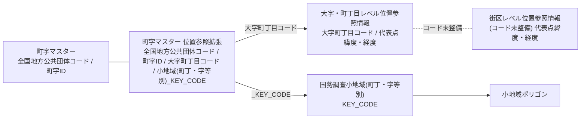

> ※上図は dp2021 図5-1 の再現。町字マスター位置参照拡張が ID対応表として、大字町丁目コードで大字・町丁目レベル位置参照情報へ、_KEY_CODE で国勢調査小地域へリンクする（街区レベル位置参照情報はコード未整備）。

【補足説明】

- **座標参照系(No.6、No.11)**：地球上の位置を座標で示す体系を定義するもの。CRS(Coordinate Reference System)。行政データ連携標準－地理座標に示されるとおり、基盤地図情報で採用される[^7]「JGD 2011/(B,L)[^8]」（日本測地系2011、測地座標系による緯度・経度）を標準とする。町字マスター位置参照拡張データでは、汎用性の観点からGIS[^9]ソフト等での指定に用いられるEPSGコード[^10]による記載とする。JGD2011（緯度・経度）のEPSGコードは6668である（「EPSG:6668」のように表記する）。座標参照系は、測量法施行令（昭和24年政令第322号）第２条（日本経緯度原点及び日本水準原点）及び第３条（長半径及び扁平率）により規定される[^11]。主な座標参照系は以下のとおり。

| EPSGコード | JIS X7115 附属書2 に基づく表記 | 座標参照系 |
|---|---|---|
| EPSG:6668 | JGD 2011 / (B, L) | 日本測地系2011（緯度・経度） |
| EPSG:4612 | JGD 2000 / (B, L) | 日本測地系2000（緯度・経度） |
| EPSG:4326 | WGS 84 / (B, L) | WGS 84 （緯度・経度） |
| EPSG:6677 | JGD 2011 / 9 (X, Y) | 日本測地系2011 平面直角座標系第IX系 |

- **地図情報レベル（No.7、No.12）**：地図（ここでは代表点とポリゴンデータ）の表現精度を表すもので、相当する地図縮尺の分母の数値で表現する。公共測量に関する「作業規程の準則」[^12]、基盤地図情報ダウンロードデータファイル仕様書などで使用される用語。

- **データフォーマット（No.10）**：ポリゴンデータはベクトル形式の地図データで整備する。主なフォーマットは以下のとおり。

| フォーマット | 説明 |
|---|---|
| シェープファイル | Esri社が策定したデータ相互交換用データフォーマット（バイナリ）。 |
| GML | 地理空間データをXMLで表現するもの。地理空間情報の標準化を行う国際的なコンソーシアムであるOGC(Open Geospatial Consortium)により開発され、ISO 19136 として標準化されている。 https://www.ogc.org/standards/gml |
| KML | 地理空間データをXMLで表現するもの。Googleに買収されたKeyhole社が開発し、OGCに移管され、国際的な標準となっている。 https://www.ogc.org/standards/kml |
| GeoJSON | 地理空間データをJSONで表現するもの。現在はIETF（Internet Engineering Task Force）が管理している。 https://geojson.org/ |

【大字・町丁目レベル位置参照情報とのリンクに関する留意点】

- 位置参照情報は年１回の更新であるため、町字マスターと整備時点が異なるケースが想定される。この場合、不整合が生じる場合がある。

【国勢調査境界データ小地域（町丁・字等別）とのリンクに関する留意点】

- 大字・町丁目レベルでリンクするよう対応情報を整備する（小字レベルは国勢調査小地域側が任意に複数小字をグルーピングしている場合があり、個々の小字では対応がつかないため）。このように国勢調査小地域のひとつの大字のエリアが複数に分割されているケースは、町字ID：小地域(KEY_CODE)が1:多となる。

- 国勢調査境界データ小地域のポリゴンは、元々水域等による分断や飛び地等の理由で、同一小地域につき複数のポリゴンを持つことができる構造である。

- 国勢調査は５年に１回の更新であるため、町字マスターと整備時点が異なるケースが想定される。この場合、不整合が生じる場合がある。

## 住所・所在地マスターデータ＜番地号レベル＞

### 番地号レベル住所・所在地マスターのID体系・データ項目の検討

ベース・レジストリとしての住所・所在地マスターデータ＜番地号レベル＞（「番地号レベル住所・所在地マスター」と称する）において、住居表示住所と地番住所は別のデータセットで管理することが望ましいと考える。

### 番地号レベル住所・所在地マスターデータのデータフォーマット案

番地号レベル住所・所在地マスターデータのセットとして、下記のデータを対象とし、データフォーマット案を示す。

- 地番マスターデータ

- 住居表示－街区マスターデータ

- 住居表示－住居マスターデータ

- 地番マスター位置参照拡張データ

- 住居表示－街区マスター位置参照拡張データ

- 住居表示－住居マスター位置参照拡張データ

#### 地番マスターデータ

表 ６‑1　地番マスターデータ フォーマット案

| No. | 項目 | Key | 区分 | 型 | 文字種 | サイズ | 説明 |
|---|---|---|---|---|---|---|---|
| 1 | 全国地方公共団体コード | ○ | ◎ | 文字列 | 半角数字 | 6 | 当該地番が属する市区町村に相当するコード |
| 2 | 町字ID | ○ | ◎ | 文字列 | 半角数字 | 7 | 当該地番が属する町字に相当するコード |
| 3 | 地番ID | ○ | ◎ | 文字列 | 半角数字 | 10 | コード体系： 5桁-地番1(本番)、5桁-地番2(支号)、5桁-地番3(支号の支号)) |
| 4 | 市区町村名 |  | ◎ | 文字列 |  |  | 全国地方公共団体コードに対応する市区町村の名称 |
| 5 | 政令市区名 |  | ○ | 文字列 |  |  |  |
| 6 | 大字・町名 |  | ◎ | 文字列 |  |  | 町字IDに対応する大字・町、丁目、小字の名称 |
| 7 | 丁目名 |  | ○ | 文字列 |  |  |  |
| 8 | 小字名 |  | ○ | 文字列 |  |  |  |
| 9 | 地番1 |  | ◎ | 文字列 |  |  | 地番（本番）　表示用 |
| 10 | 地番2 |  | ○ | 文字列 |  |  | 地番（支号）　表示用 |
| 11 | 地番3 |  | ○ | 文字列 |  |  | 地番（支号の支号）　表示用 ※例外的に存在し得る |
| 12 | 住居表示フラグ | ○ | ◎ | 整数 |  |  | (1:住居表示実施 0:住居表示非実施） ※親となる町字に関する属性 ※住居表示実施区域の地番レコードは登記上の住所・所在地表現のデータとなる |
| 13 | 地番レコード区分フラグ |  |  | 整数 |  |  | 当該レコードが最下層(一筆)のものか、親番等上位階層のものかを識別するフラグ (1：最小単位のレコード　0：上位階層のレコード) |
| 14 | 地番区域コード |  |  | 整数 |  |  | (1:大字・町丁目 2:小字 3:市区町村) 不動産登記規則　（平成17年法務省令第18号）97・98条 ※地番がユニークとなる単位 |
| 15 | 効力発生日 |  |  | 日付 | YYYY-MM-DD |  | 地番の設定の実施日 |
| 16 | 廃止日 |  |  | 日付 | YYYY-MM-DD |  | 当該地番の廃止の実施日 |
| 17 | 原典資料コード |  |  | 整数 |  |  | 原典資料を表すコード |
| 18 | 備考 |  |  | 文字列 |  |  | 特記事項があれば記載 |

#### 住居表示－街区マスターデータ

表 ６‑2　住居表示－街区マスターデータ フォーマット案

| No. | 項目 | Key | 区分 | 型 | 文字種 | サイズ | 説明 |
|---|---|---|---|---|---|---|---|
| 1 | 全国地方公共団体コード | ○ | ◎ | 文字列 | 半角数字 | 6 | 当該街区符号が属する市区町村に相当するコード |
| 2 | 町字ID | ○ | ◎ | 文字列 | 半角数字 | 7 | 当該街区符号が属する町字に相当するコード |
| 3 | 街区ID | ○ | ◎ | 文字列 | 半角数字 | 3 | 街区符号を一意に識別するためのコード |
| 4 | 市区町村名 |  | ◎ | 文字列 |  |  | 全国地方公共団体コードに対応する市区町村の名称 |
| 5 | 政令市区名 |  | ○ | 文字列 |  |  |  |
| 6 | 大字・町名 |  | ◎ | 文字列 |  |  | 町字IDに対応する大字・町、丁目、小字の名称 |
| 7 | 丁目名 |  | ○ | 文字列 |  |  |  |
| 8 | 小字名 |  | ○ | 文字列 |  |  |  |
| 9 | 街区符号 |  | ◎ | 文字列 |  |  | 表示用　※数字以外の場合があり得る |
| 10 | 住居表示フラグ | ○ | ◎ | 整数 |  |  | (1:住居表示実施 0:住居表示非実施） ※必ず「1」 |
| 11 | 住居表示方式コード |  | ◎ | 整数 |  |  | (1:街区方式　2:道路方式 0:住居表示でない)　※「1」か「2」 |
| 12 | 効力発生日 |  |  | 日付 | YYYY-MM-DD |  | 当該地番が生じた日（登記等の実施日） |
| 13 | 廃止日 |  |  | 日付 | YYYY-MM-DD |  | 当該地番の廃止の実施日 |
| 14 | 原典資料コード |  |  | 整数 |  |  | 原典資料を表すコード |
| 15 | 備考 |  |  | 文字列 |  |  | 特記事項があれば記載 |

#### 住居表示－住居マスターデータ

表 ６‑3　住居表示－住居マスターデータ フォーマット案

| No. | 項目 | Key | 区分 | 型 | 文字種 | サイズ | 説明 |
|---|---|---|---|---|---|---|---|
| 1 | 全国地方公共団体コード | ○ | ◎ | 文字列 | 半角数字 | 6 | 当該住居番号が属する市区町村に相当するコード |
| 2 | 町字ID | ○ | ◎ | 文字列 | 半角数字 | 7 | 当該住居番号が属する町字に相当するコード |
| 3 | 街区ID | ○ | ◎ | 文字列 | 半角数字 | 3 | 当該住居番号が属する街区に相当するコード |
| 4 | 住居ID | ○ | ◎ | 文字列 | 半角数字 | 3 | 住居番号を一意に識別するためのコード |
| 5 | 住居2ID |  |  | 文字列 | 半角数字 | 5 | 住居番号が団地・中高層建物の特例、または枝番の設定により2つの番号を組み合わせて構成される場合の後の番号（各戸の番号等）に対するコード |
| 6 | 市区町村名 |  | ◎ | 文字列 |  |  | 全国地方公共団体コードに対応する市区町村の名称 |
| 7 | 政令市区名 |  | ○ | 文字列 |  |  |  |
| 8 | 大字・町名 |  | ◎ | 文字列 |  |  | 町字IDに対応する大字・町、丁目、小字の名称 |
| 9 | 丁目名 |  | ○ | 文字列 |  |  |  |
| 10 | 小字名 |  | ○ | 文字列 |  |  |  |
| 11 | 街区符号 | ○ | ○ | 文字列 |  |  | 表示用 （街区方式の住居表示の場合は必須、 道路方式の住居表示の場合は空欄） |
| 12 | 住居番号 |  | ◎ | 文字列 |  |  | 表示用 |
| 13 | 住居番号2 |  |  | 文字列 |  |  | 住居番号が団地・中高層建物の特例、または枝番の設定により2つの番号を組み合わせて構成される場合の後の番号（各戸の番号等） |
| 14 | 住居表示フラグ |  | ◎ | 整数 |  |  | (1:住居表示実施 0:住居表示非実施） ※必ず「1」 |
| 15 | 住居表示方式コード |  | ○ | 整数 |  |  | (1:街区方式　2:道路方式 0:住居表示でない)　※「1」か「2」 |
| 16 | 効力発生日 |  |  | 日付 | YYYY-MM-DD |  | 当該地番が生じた日（登記等の実施日） |
| 17 | 廃止日 |  |  | 日付 | YYYY-MM-DD |  | 当該地番の廃止の実施日 |
| 18 | 原典資料コード |  |  | 整数 |  |  | 原典資料を表すコード |
| 19 | 備考 |  |  | 文字列 |  |  | 特記事項があれば記載 |

###  　地番マスター位置参照拡張データ

表 ６‑4 　地番マスター位置参照拡張データ フォーマット案

| No. | 項目                        | Key | 区分 | 型     |          | サイズ | 説明                                     |                                                        |
|-----|-----------------------------|-----|------|--------|----------|--------|------------------------------------------|--------------------------------------------------------|
| 1   | 全国地方公共団体コード      | ○   | ◎    | 文字列 | 半角数字 | 6      | 当該地番が属する市区町村に相当するコード |                                                        |
| 2   | 町字ID                      | ○   | ◎    | 文字列 | 半角数字 | 7      | 当該地番が属する町字に相当するコード     |                                                        |
| 3   | 地番ID                      | ○   | ◎    | 文字列 | 半角数字 | 3      | 当該地番に相当するコード                 |                                                        |
| 4   | 代表点_経度                 |     |      | 実数   |          |        | データ発行者が整備する場合に使用         | 単位：度、10進法小数点表示                             |
| 5   | 代表点_緯度                 |     |      | 実数   |          |        |                                          | 単位：度、10進法小数点表示                             |
| 6   | 代表点_座標参照系           |     |      | 文字列 |          |        |                                          | 代表点緯度経度の座標参照系、EPSG:4326など              |
| 7   | 代表点_地図情報レベル       |     |      | 文字列 |          |        |                                          | 整備時に背景とする地図（測量成果）の縮尺の分母の数値   |
| 8   | ポリゴン_ファイル名         |     |      | 文字列 |          |        | データ発行者が整備する場合に使用         |                                                        |
| 9   | ポリゴン_キーコード         |     |      | 文字列 |          |        |                                          | ファイル内に複数のポリゴンデータが収録される場合に使用 |
| 10  | ポリゴン_データフォーマット |     |      | 文字列 |          |        |                                          | シェープファイル、GeoJSON、KMLなど                     |
| 11  | ポリゴン_座標参照系         |     |      | 文字列 |          |        |                                          | ポリゴンの座標参照系                                   |
| 12  | ポリゴン_地図情報レベル     |     |      | 文字列 | 半角数字 |        |                                          | 整備時に背景とする地図（測量成果）の縮尺の分母の数値   |
| 13  | 法務省地図_市区町村コード   |     |      | 文字列 | 半角文字 | 5      | 法務省を参照する場合に使用               |                                                        |
| 14  | 法務省地図_大字コード       |     |      | 文字列 | 半角文字 | 3      |                                          |                                                        |
| 15  | 法務省地図_丁目コード       |     |      | 文字列 | 半角文字 | 3      |                                          |                                                        |
| 16  | 法務省地図_小字コード       |     |      | 文字列 | 半角文字 | 4      |                                          |                                                        |
| 17  | 法務省地図_予備コード       |     |      | 文字列 | 半角文字 | 2      |                                          |                                                        |
| 18  | 法務省地図_筆id             |     |      | 文字列 |          |        |                                          |                                                        |

> 地番マスターに対し、位置参照に関する情報を収録するための拡張データである。データ発行者が独自に代表点やポリゴンデータを整備する場合と、法務省地図[^13]を参照することが可能な場合に対応する。

#### 住居表示－街区マスター位置参照拡張データ

表 ６‑5 　住居表示－街区マスター位置参照拡張データ フォーマット案

| No. | 項目                                                           | Key | 区分 | 型     |            | サイズ | 説明                                                           |                                                                                              |
|-----|----------------------------------------------------------------|-----|------|--------|------------|--------|----------------------------------------------------------------|----------------------------------------------------------------------------------------------|
| 1   | 全国地方公共団体コード                                         | ○   | ◎    | 文字列 | 半角数字   | 6      | 当該街区符号が属する市区町村に相当するコード                   |                                                                                              |
| 2   | 町字ID                                                         | ○   | ◎    | 文字列 | 半角数字   | 7      | 当該街区符号が属する町字に相当するコード                       |                                                                                              |
| 3   | 街区ID                                                         | ○   | ◎    | 文字列 | 半角数字   | 3      | 当該街区符号に相当するコード                                   |                                                                                              |
| 4   | 住居表示フラグ                                                 |     |      | 整数   |            |        | (1:住居表示実施 0:住居表示非実施）                             |                                                                                              |
| 5   | 住居表示方式コード                                             |     |      | 整数   |            |        | (1:街区方式　2:道路方式 0:住居表示でない)                      |                                                                                              |
| 6   | 代表点_経度                                                    |     |      | 実数   |            |        | データ発行者が整備する場合に使用                               | 単位：度、10進法小数点表示                                                                   |
| 7   | 代表点_緯度                                                    |     |      | 実数   |            |        |                                                                | 単位：度、10進法小数点表示                                                                   |
| 8   | 代表点_座標参照系                                              |     |      | 文字列 |            |        |                                                                | 代表点緯度経度の座標参照系、EPSG:6668など                                                    |
| 9   | 代表点_地図情報レベル                                          |     |      | 文字列 | 半角数字   |        |                                                                | 整備時に背景とする地図（測量成果）の縮尺の分母の数値                                         |
| 10  | ポリゴン_ファイル名                                            |     |      | 文字列 |            |        | データ発行者が整備する場合に使用                               |                                                                                              |
| 11  | ポリゴン_キーコード                                            |     |      | 文字列 |            |        |                                                                | ファイル内に複数のポリゴンデータが収録される場合に使用                                       |
| 12  | ポリゴン_データフォーマット                                    |     |      | 文字列 |            |        |                                                                | シェープファイル、GeoJSON、KMLなど                                                           |
| 13  | ポリゴン_座標参照系                                            |     |      | 文字列 |            |        |                                                                | ポリゴンの座標参照系                                                                         |
| 14  | ポリゴン_地図情報レベル                                        |     |      | 文字列 | 半角数字   |        |                                                                | 整備時に背景とする地図（測量成果）の縮尺の分母の数値                                         |
| 15  | 位置参照情報_都道府県名                                        |     |      | 文字列 |            |        | 位置参照情報を参照する場合に使用                               | 街区レベル位置参照情報の都道府県名                                                           |
| 16  | 位置参照情報_市区町村名                                        |     |      | 文字列 |            |        |                                                                | 街区レベル位置参照情報の市区町村名                                                           |
| 17  | 位置参照情報_大字・町丁目名                                    |     |      | 文字列 |            |        |                                                                | 街区レベル位置参照情報の大字・町丁目名                                                       |
| 18  | 位置参照情報_小字・通称名                                      |     |      | 文字列 |            |        |                                                                | 街区レベル位置参照情報の小字・通称名                                                         |
| 19  | 位置参照情報_街区符号・地番                                    |     |      | 文字列 |            |        |                                                                | 街区レベル位置参照情報の街区符号・地番                                                       |
| 20  | 位置参照情報_データ整備年度                                    |     |      | 文字列 | 半角数字   |        |                                                                | 街区レベル位置参照情報の整備年度（西暦）                                                     |
| 21  | 電子国土基本図（地名情報）「住居表示住所」\_住所コード（可読） |     |      | 文字列 | 半角数字   |        | 電子国土基本図（地名情報）「住居表示住所」を参照する場合に使用 | 電子国土基本図（地名情報）「住居表示住所」の住所コード（可読）における街区レベルまでのコード |
| 22  | 電子国土基本図（地名情報）「住居表示住所」\_データ整備日       |     |      | 日付   | YYYY-MM-DD |        |                                                                | 電子国土基本図（地名情報）「住居表示住所」の更新日                                           |

> 住居表示－街区マスターに対し、位置参照に関する情報を収録するための拡張データである。データ発行者が独自に代表点やポリゴンデータを整備する場合と、既存オープンデータを参照する場合に対応する。
>
> ４.３ に示したとおり、この住居表示－街区マスター位置参照拡張データがID対応表として街区レベル位置参照情報へのリンクと、電子国土基本図（地名情報）「住居表示住所」（国土地理院）へのリンクを可能にする。なお、電子国土基本図（地名情報）「住居表示住所」の個々のレコードは住居表示の住居レベルであり、直接的に街区レベルの座標情報を取得できるわけではない。

#### 住居表示－住居マスター位置参照拡張データ

表 ６‑6 　住居表示－住居マスター位置参照拡張データ フォーマット案

| No. | 項目                                                           | Key | 区分 | 型     |            | サイズ | 説明                                                                                                             |                                                                |
|-----|----------------------------------------------------------------|-----|------|--------|------------|--------|------------------------------------------------------------------------------------------------------------------|----------------------------------------------------------------|
| 1   | 全国地方公共団体コード                                         | ○   | ◎    | 文字列 | 半角数字   | 6      | 当該住居番号が属する市区町村に相当するコード                                                                     |                                                                |
| 2   | 町字ID                                                         | ○   | ◎    | 文字列 | 半角数字   | 7      | 当該住居番号が属する町字に相当するコード                                                                         |                                                                |
| 3   | 街区ID                                                         | ○   | ◎    | 文字列 | 半角数字   | 3      | 当該住居番号が属する街区に相当するコード                                                                         |                                                                |
| 4   | 住居ID                                                         | ○   | ◎    | 文字列 | 半角数字   | 3      | 当該住居番号に相当するコード、または住居2（枝番等）がある場合は当該住居2が属する住居番号（親番）に相当するコード |                                                                |
| 5   | 住居2ID                                                        |     |      | 文字列 | 半角数字   | 5      | 当該住居番号に相当するコード                                                                                     |                                                                |
| 6   | 住居表示フラグ                                                 |     |      | 整数   |            |        | (1:住居表示実施 0:住居表示非実施）                                                                               |                                                                |
| 7   | 住居表示方式コード                                             |     |      | 整数   |            |        | (1:街区方式　2:道路方式 0:住居表示でない)                                                                        |                                                                |
| 8   | 代表点_経度                                                    |     |      | 実数   |            |        | データ発行者が整備する場合に使用                                                                                 | 単位：度、10進法小数点表示                                     |
| 9   | 代表点_緯度                                                    |     |      | 実数   |            |        |                                                                                                                  | 単位：度、10進法小数点表示                                     |
| 10  | 代表点_座標参照系                                              |     |      | 文字列 |            |        |                                                                                                                  | 代表点緯度経度の座標参照系、EPSG:6668など                      |
| 11  | 代表点_地図情報レベル                                          |     |      | 文字列 | 半角数字   |        |                                                                                                                  | 整備時に背景とする地図（測量成果）の縮尺の分母の数値           |
| 12  | 電子国土基本図（地名情報）「住居表示住所」\_住所コード（可読） |     |      | 文字列 | 半角数字   |        | 電子国土基本図（地名情報）「住居表示住所」を参照する場合に使用                                                   | 電子国土基本図（地名情報）「住居表示住所」の住所コード（可読） |
| 13  | 電子国土基本図（地名情報）「住居表示住所」\_データ整備日       |     |      | 日付   | YYYY-MM-DD |        |                                                                                                                  | 電子国土基本図（地名情報）「住居表示住所」の更新日             |

> 住居表示－住居マスターに対し、位置参照に関する情報を収録するための拡張データである。データ発行者が独自に代表点を整備する場合と、既存オープンデータを参照する場合に対応する。住居番号は、その性質上ポリゴンで表現するには適さないため代表点のみの整備とする。

### ４.３ に示したとおり、この住居表示－住居マスター位置参照拡張データがID対応表として電子国土基本図（地名情報）「住居表示住所」（国土地理院）へのリンクを可能にする。 

## 町字に関する告示情報のデータ標準化の検討

### 町字レベル住所・所在地マスターデータの最新性の確保

町字レベル住所・所在地マスターデータがベース・レジストリとして十分に機能するには、正確性や最新性の確保が求められる。このうち最新性については、異動が生じた場合の更新を適時行うことが必要となる。

町字レベルの住所・所在地に異動が生じるケースは、主に以下がある。

- 町字の区域・名称の新設・廃止・変更（地方自治法第260条）

- 住居表示の実施（住居表示に関する法律）

これらはいずれも市町村による告示の義務があるため、告示の情報をデータ更新に活用することになる。そこで、本章ではあくまでも参考として告示情報のデータ標準化を検討する。

### 町字の区域・名称の新設・廃止・変更の告示

#### 町字の区域・名称の新設・廃止・変更

> 町字の区域・名称の新設・廃止・変更は、地方自治法第260条に基づき市町村が実施し、告示の義務がある（詳細は、「１０.１町字レベルの住所・所在地の異動」を参照）。以下のような種類がある。

- 区域の画定（新設）

- 区域の廃止

- 区域の変更

- 名称の変更

#### 告示の概要

> 資料 ７‑1 にインターネット上で公開されている告示の例を示す。変更等の内容は、別紙として示されることが多く、変更調書が別紙に使われるケースも多いようである。また、図面が添付されることもある。

資料 ７‑1　告示の例（町字の区域・名称の新設・廃止・変更）

#### 町字の区域・名称の新設・廃止・変更の告示情報の構造

> 告示に示される情報について、データとして取り扱うことを想定した場合のデータ形式は以下のように表現できる。

表 ７‑1　町字の区域・名称の新設・廃止・変更の情報の構造

| No. | 項目 | 型 | 出現数 | 説明 |  |  |  |  |
|---|---|---|---|---|---|---|---|---|
| 最小 | 最大 |  |  |  |  |  |  |  |
| 1 | 告示ID | 文字列 |  | 1 | 1 | 同一の告示に同じIDを収録 |  |  |
| 2 | 告示タイトル | 文字列 |  | 1 | 1 | 例-「大字・字の区域の変更及び廃止について」 |  |  |
| 3 | 告示日 | 文字列 | 半角英数 | 1 | 1 | “YYYY-MM-DD”形式 |  |  |
| 4 | 効力発生日 | 文字列 | 半角英数 | 1 | 1 | “YYYY-MM-DD”形式 日付として決まっていない場合はNull許容 |  |  |
| 5 | 効力発生日タイプ | 整数 |  | 1 | 1 | (0：通常　1:土地改良事業　2：土地区画整理事業　3：国土調査　4：その他) |  |  |
| 6 | タイプ | 整数 |  | 1 | 1 | (1：町字の区域の画定　2：町字の区域の廃止　4：町字の区域の変更　8：町字の名称の変更) |  |  |
|  |  |  |  | 1 | * |  |  |  |
| 7 |  | 新 | 市区町村コード | 文字列 | 半角数字 | 1 | 1 | 町字レベル住所・所在地マスターにリンク |
| 8 | 町字ID | 文字列 | 半角数字 | 1 | 1 | 町字レベル住所・所在地マスターにリンク |  |  |
| 9 | 市区町村名 | 文字列 |  | 1 | 1 | 告示の変更調書には表示されないケースが大半だが、データ管理上保持 |  |  |
| 10 | 町字名 | 文字列 |  | 1 | 1 | 告示の変更調書に表示する名称 |  |  |
| 11 | 小字名 | 文字列 |  | 0 | 1 | 告示の変更調書に表示する名称 ※小字がない場合はNULL |  |  |
| 12 | 地番 | 文字列 |  | 0 | 1 | 地番整理が行われる場合で、告示にその新しい地番を示す必要がある場合に使用 |  |  |
|  |  |  |  | 1 | * |  |  |  |
| 13 |  | 旧 | 市区町村コード | 文字列 | 半角数字 | 1 | 1 | 町字レベル住所・所在地マスターにリンク |
| 14 | 町字ID | 文字列 | 半角数字 | 1 | 1 | 町字レベル住所・所在地マスターにリンク |  |  |
| 15 | 市区町村名 | 文字列 |  | 1 | 1 | 告示の変更調書には表示されないケースが大半だが、データ管理上保持、市町村合併に伴う町字の区域・名称の変更等の場合は旧市区町村名を収録 |  |  |
| 16 | 町字名 | 文字列 |  | 1 | 1 | 告示の変更調書に表示する名称 |  |  |
| 17 | 小字名 | 文字列 |  | 0 | 1 | 告示の変更調書に表示する名称 ※小字がない場合はNULL |  |  |
| 18 | 地番 | 文字列 |  | 0 | 1 | 告示で「、」や空白で区切られる個々の地番の羅列、または地番＋介在・隣接・地先などの道路・水路等公有地等自由な文字列で記載（但し、フィールドセパレータの記号を地番と地番の区切り文字としてフィールド内に収録しないこと） |  |  |
| 19 | 新たに生じた土地の面積 | 文字列 |  | 0 | 1 | 新たに生じた土地に対して町字の区域の画定が行われる場合に記載する面積を単位まで含めて自由な文字列で記載 |  |  |
| 20 | 新町字にかかる介在・隣接・地先コメント |  |  | 0 | 1 | (*1) |  |  |
| 21 | 告示対象全体にかかる介在・隣接・地先コメント | 文字列 |  | 1 | 1 | (*1) |  |  |
|  |  |  |  | 0 | * |  |  |  |
| 22 |  | 図面名 |  |  | 1 | 1 | 図面名称（位置図、概略図、明細図等） |  |
| 23 | 図面ファイル名 |  |  | 1 | 1 | データファイルの名称 |  |  |
| 24 | 告示表示用備考 | 文字列 |  | 1 | 1 | 告示に備考を表示する場合に文字列を収録 |  |  |
| 25 | 備考 | 文字列 |  | 1 | 1 | データに関する全般的な特記事項 |  |  |
| (*1) 文字列として、「及びこれらの区域に隣接介在する道路、水路である公有地の一部」のように収録 |  |  |  |  |  |  |  |  |

> 以下、データ構造に関する補足説明を記す。

- データ構造は、階層を持ち、繰り返し出現する項目を持つ形態となる。

- **地番**（No.18）：任意に複数の地番等を列記した文字列を収録する。「●から●まで」「●の一部」「●から●までの各一部」「全部」「●、●を除く全部」などの表現が用いられる。よりデータベース的なデータの持ち方としては個々の地番を配列として持つ形態も考えられる。但し、筆の一部が対象となるケースがあるため「●の一部」の表現は残る。

- **効力発生日**（No.4）：告示日と効力発生日が異なるケースが多いため別項目とする。但し、土地改良事業や土地区画整理事業等で「換地処分の告示があった日の翌日」と表現される場合がある。

- 「及びこれらの区域に隣接介在する道路、水路である公有地の一部」に類する記述は、公開されている告示を参考にすると以下のようなパターンがある。

  1.  個々の地番に付して示される場合

  2.  個々の旧大字・（小）字の地番列記に付して示される場合

  3.  個々の新大字・（小）字に付して示される場合（複数の旧大字・（小）字を束ねて付される）

  4.  告示全体に対して付して示される場合

#### 参考：告示のパターン例

> 実際の告示のパターンは以下のようなものがある。

①町字の区域の画定－新たに生じた土地に新規町字を設定 （例）

　※新たに生じた土地は別途地方自治法第９条の５に基づく告示を伴う。

| 新 (新たに生じた土地が画される字の区域) |     | 旧 （新たに生じた土地の所在） |     |                           |                        |
|-----------------------------------------|-----|-------------------------------|-----|---------------------------|------------------------|
| 大字                                    | 字  | 大字                          | 字  | 地番                      | 新たに生じた土地の面積 |
| AAA                                     | BBB | AAA                           | CCC | 200の地先の公有水面埋立地 | 1,518.00平方メートル   |

②町字の区域の変更－新たに生じた土地を既存町字に編入 （例）

　※新たに生じた土地は別途地方自治法第９条の５に基づく告示を伴う。

| 新(新たに生じた土地が編入される字の区域) |     | 旧（新たに生じた土地の所在） |     |                                             |                        |
|------------------------------------------|-----|------------------------------|-----|---------------------------------------------|------------------------|
| 大字                                     | 字  | 大字                         | 字  | 地番                                        | 新たに生じた土地の面積 |
| AAA                                      | BBB | AAA                          | BBB | 1040の1地先から1125地先までの公有水面埋立地 | 4,332.10平方メートル   |

③町字の区域の変更 （例）

| 新（変更後） | 旧（変更前） |  |  |  |
|---|---|---|---|---|
| 大字 | 字 | 大字 | 字 | 地番 |
| AAA | BBB | AAA | CCC | 18、19の2、29の一部 上記の区域に隣接介在する道路、水路である公有地の全部 |
| DDD | 35の一部 |  |  |  |
| EEE | FFF | 70の2の一部、74から76までの各一部 上記の区域に隣接介在する道路、水路である公有地の全部 |  |  |
| GGG | 12の6、13の2、14の4の地先の道路である公有地の一部 |  |  |  |
| HHH | JJJ | AAA | KKK | 507、508の1、513の2 |
| LLL | MMM | 944の1、944の2の地先の水路等である公有地の一部及びこれらの区域に隣接介在する道路、水路である公有地の一部 |  |  |

④町字の区域の変更－字の廃止 （例）

| 新   |     | 旧   |     |                                                                                             |
|------|-----|------|-----|---------------------------------------------------------------------------------------------|
| 大字 | 字  | 大字 | 字  | 地番                                                                                        |
| AAA  |     | AAA  | BBB | 438、439、439-2、440-1から440-6まで、441、乙441、441-3から441-5まで、＜中略＞、545-4、545-5 |
|      |     |      | CCC | 547、547-2、547-3、548、549-1から549-6まで、571-1、572-3、＜中略＞、590-5、590-10           |

⑤町字の区域・名称の変更－住居表示のため大字の区域が分割　（例）

　※字・地番に変更のないケース。

　※実際には下表のような表組みで示されることは少ない。

| 新        | 旧    |
|-----------|-------|
| 大字      | 大字  |
| AAA一丁目 | AAA町 |
| AAA二丁目 |       |
| AAA三丁目 |       |

⑥町字の名称の変更－市町村合併　（例）

　※地番に変更のないケース。

| 新     |     | 旧         |      |     |
|--------|-----|------------|------|-----|
| 大字   | 字  | 旧市町村名 | 大字 | 字  |
| AAABBB | FFF | AAA        | BBB  | FFF |
|        | GGG |            |      | GGG |
| AAACCC |     |            | CCC  |     |
| AAADDD |     |            | DDD  |     |
| AAAEEE |     |            | EEE  |     |

### 住居表示の実施の告示

#### 住居表示の実施

> 住居表示の実施は、住居表示に関する法律に基づき、市町村が行い、告示の義務がある（詳細は、「１０.１町字レベルの住所・所在地の異動」を参照）。告示に記載する事項は、以下のとおりである。

- 区域

- 期日

- 住居表示の方法（街区方式か道路方式か）

- 街区符号又は道路の名称、住居番号

> 住居表示の実施に伴い、町字の区域・名称の新設・廃止・変更（地方自治法第260条）を実施する場合があるが、別途前述の町字の区域・名称の新設・廃止・変更の告示がされる。

#### 告示の概要

> 資料 ７‑2 にインターネット上で公開されている告示の例を示す。旧新対照表、新旧対照表、新旧対照案内図が付される場合も多いようである。

資料 ７‑2告示の例（住居表示の実施）

#### 住居表示実施の告示情報の構造

> 告示に示される情報について、データとして取り扱うことを想定した場合のデータ形式は以下のように表現できる。

表 ７‑2　住居表示実施の告示情報の構造

| No. | 項目 | 型 | 出現数 | 説明 |  |  |  |
|---|---|---|---|---|---|---|---|
| 最小 | 最小 |  |  |  |  |  |  |
| 1 | 告示ID | 文字列 |  | 1 | 1 |  |  |
| 2 | 告示タイトル | 文字列 |  | 1 | 1 | 例-「住居表示の実施について」 |  |
| 3 | 告示日 | 文字列 | 半角英数 | 1 | 1 | “YYYY-MM-DD”形式 |  |
| 4 | 実施日 | 文字列 | 半角英数 | 1 | 1 | “YYYY-MM-DD”形式 |  |
| 5 | 住居表示方式コード | 整数 |  | 1 | 1 | (1:街区方式　2:道路方式　3:街区方式と道路方式の混合) |  |
| 6 | 市区町村コード | 文字列 | 半角数字 | 1 | 1 | 町字レベル住所・所在地マスターにリンク |  |
| 7 | 市区町村名 | 文字列 |  | 1 | 1 |  |  |
|  |  |  |  | 0 | * |  |  |
| 8 |  | 町字ID | 文字列 | 半角数字 | 1 | 1 | 町字レベル住所・所在地マスターにリンク 実施区域の町字ID　※新町字 |
| 9 | 大字・町名 | 文字列 |  | 1 | 1 | 実施区域の町字IDに対応する大字・町名 |  |
| 10 | 丁目名 | 文字列 |  | 1 | 1 | 実施区域の町字IDに対応する丁目名 |  |
| 11 | 住居表示方式コード |  |  | 1 | 1 | (1:街区方式　2:道路方式) ※道路方式の場合、大字・町名（No.9）に道路名が入る |  |
| 12 | 対象区域区分コード | 整数 |  | 1 | 1 | （1:大字町丁目の全域が対象　2:大字町丁目の一部が対象　0:道路方式のため対象外） |  |
| 14 | 実施区域図の提供有無 | 整数 |  | 1 | 1 | （0:なし　1:インターネット公開有り　2:物理掲示公開有り） |  |
| 15 |  | 実施区域図の公開URL | 文字列 |  | 0 | * | 「https:」から始まるURL文字列 |
| 16 | 新旧対照案内図（街区まで）の提供有無 | 整数 |  | 1 | 1 | （0:なし　1:インターネット公開有り　2:物理掲示公開有り） |  |
| 17 |  | 新旧対照図（街区まで）の公開URL | 文字列 |  | 0 | * | 「https:」から始まるURL文字列 |
| 18 | 新旧対照案内図（住居番号まで）の提供有無 | 整数 |  | 1 | 1 | （0:なし　1:インターネット公開有り　2:物理掲示公開有り） |  |
| 19 |  | 新旧対照図（住居番号）の公開URL | 文字列 |  | 0 | * | 「https:」から始まるURL文字列 |
| 20 | 旧新対照表（住居番号）の提供有無 | 整数 |  | 1 | 1 | （0:なし　1:インターネット公開有り　2:物理掲示公開有り） |  |
| 21 |  | 旧新対照表（住居番号）の公開URL | 文字列 |  | 0 | * | 「https:」から始まるURL文字列 |
| 22 | 新旧対照表（住居番号）の提供有無 | 整数 |  | 1 | 1 | （0:なし　1:インターネット公開有り　2:物理掲示公開有り） |  |
| 23 |  | 新旧対照表（住居番号）の公開URL | 文字列 |  | 0 | * | 「https:」から始まるURL文字列 |
| 24 | 備考 |  |  | 0 | 1 |  |  |

#### 住居表示実施新旧対照データの構造

> 告示に付される新旧・旧新対照の情報について、データとして取り扱うことを想定した場合のデータ形式は以下のように表現できる。

表 ７‑3　住居表示実施新旧対照データの構造

No.
項目
型
出現数
説明

最小
最大

1
告示ID
文字列

1
1
告示データとのリンクキー

2
住居表示実施日
文字列
半角英数
1
1
“YYYY-MM-DD”形式

1
*

3

新
市区町村コード
文字列
半角数字
1
1
町字レベル住所・所在地マスターにリンク

4
町字ID
文字列
半角数字
1
1
町字レベル住所・所在地マスターにリンク

5
市区町村名
文字列

1
1

6
大字・町名
文字列

1
1

7
丁目名
文字列

0
1

8
街区符号
文字列

1
1
新規に設定された街区符号(表示用)

9
住居番号
文字列

1
1
新規に設定された住居番号（表示用）

10
旧
市区町村コード
文字列
半角数字
1
1
町字レベル住所・所在地マスターにリンク

11
町字ID
文字列
半角数字
1
1
町字レベル住所・所在地マスターにリンク

12
市区町村名
文字列

1
1

13
大字・町名
文字列

1
1

14
丁目名
文字列

0
1

15
小字名
文字列

0
1

16
街区符号
文字列

0
1
旧住所が住居表示実施済みで街区が整理される場合に使用

17
住居番号
文字列

0
1
旧住所が住居表示実施済みで街区が整理される場合に使用

18
地番
文字列

0
1

旧住所が住居表示非実施の場合に使用

数字は半角を使用

支号は半角”-“（ハイフン）でつなぐ

19
旧住所備考
文字列

0
1
地区名称等の記載が必要な場合

20
方書
文字列

0
1
集合住宅名や部屋番号等を記載する場合

21
旧新対照表に記載する備考
文字列

1
1

22
備考
文字列

1
1

> 以下、データ構造に関する補足説明である。

- 「旧新対照表」と「新旧対照表」の両方が提供されるケースがあるが、データは1つとし、出力時にいずれも出力可能とする。

- 対応したい新旧対照表のパターン例を以下に示す。

表 ７‑4　新旧対照表のパターン例

| 新        |          |          | 旧   |        |                      | 備考 |
|-----------|----------|----------|------|--------|----------------------|------|
| 町名      | 街区符号 | 住居番号 | 町名 | 番地   | 方書                 |      |
| AAA一丁目 | 1        | 7        | BBB  | 779-1  |                      |      |
| 〃        | 1        | 7-101    | 〃   | 779-1  | ○○マンション　１０１ |      |
| 〃        | 1        | 7-102    | 〃   | 779-1  | ○○マンション　１０2  |      |
| 〃        | 1        | 17       | 〃   | 777-16 |                      |      |
| 〃        | 1        | 18       | 〃   | 777-15 |                      |      |
| 〃        | 1        | 19       | 〃   | 777-14 |                      |      |
| 〃        | 2        | 6        | BBB  | 787-2  |                      |      |
| 〃        | 2        | 12       | 〃   | 788-1  |                      |      |
| 〃        | 2        | 25       | 〃   | 783    |                      |      |

## 住所のベース・レジストリ化による経済効果

住所のベース・レジストリ化は、大きな経済効果があると言われている。

### 国の規模による推定

住所データの投資額が公表されている国との規模の違いは以下のとおりである。

|                  | 人口      | 国土                 |
|------------------|-----------|----------------------|
| 日本             | 12581万人 | 377975km2 |
| デンマーク       | 582万人   | 43094km2  |
| 英国             | 6644万人  | 244820km2 |
| 日本／デンマーク | 21倍      | 8.7倍                |
| 日本／英国       | 2倍       | 1.5倍                |

> 各国の5年あたりの投資と効果は日本円に換算すると以下のとおりである。

|  | 投資 | 効果 | 投資対効果 |
|---|---|---|---|
| デンマーク (2005-2010) | 3.5億円 | 96億円 | 27.5倍 |
| デンマーク (2015-2020) | 40億円 | 200億円 | 5倍 |
| 英国 (2010-2015) | 6億円 | 12億円 | 2倍 |
| 英国 (2015-2020) | 70億円 | 282億円 | 4倍 |

€1=125、£1=140、常勤職員1名のコスト1000万円で計算

> 海外の投資額が大きいのは住所のポリゴンまで住所データベースに登録しているためと考えられる。

### 想定コストによる推定

「行政手続等の棚卸結果等の概要」（2020年7月2日内閣官房IT総合戦略室、総務省）によると、国と自治体における年間の手続は24億件である。これらの手続で住所の記述がないものは考えられず、書類によっては複数箇所の記入が求められる。また、添付書類取得のために住所を記入する場合もある。軽微な間違いを除き、１％の書類で修正が必要な住所間違いがある場合、その例外処理に1000円かかるとして、240億円のコストが無駄に発生する。今後、自動審査が進み、住所の自動照合ができるようになるとエラー率はもっと上がると考えられる。

### 日本の想定

> 海外と同レベルでポリゴンまで整備する場合、国の規模で換算すると、日本は、年間で20億円の投資で100億円程度の効果が見込まれる。一方、日本の住所活用ではポリゴン情報を使用する場面が少ないので、テキストデータの登録に絞ることで、投資額を抑えた上で住所データの整備を進め、徐々にポリゴンに拡大していく方法が考えられる。
>
> 利用想定から考えると、行政内の削減効果も大きいが、デンマークでは民間での活用が70%であることを考えると、日本でも民間利用でのコスト削減効果が得られるものと考えられ、そこでも数百億円の効果が見込まれる。
>
> いずれにしても、住所データの整備は、国内で数百億円レベルの効果が見込めると考えられる。

###  

## 【付属資料１】町字ID付番ガイドライン

本ディスカッションペーパーで提示する町字レベル住所・所在地マスターデータのデータフォーマット案における、町字ID付番に係るガイドラインを示す。

### 町字IDの付番方法

町字IDは、町字を構成する２階層を表現し、上４桁で「大字・町」、下３桁で「丁目・小字」を表す。

①小字の扱い

大字のみのレコード、各小字のレコードを収録する。同じ大字の配下にある小字の町字IDは、上４桁は同一数字とする。小字の町字IDは下３桁に101以降の数字を使う。

大字A

小字

X

小字

Y

小字

Z

| レコード | フィールド     | 収録値（例）       |       |
|----------|----------------|--------------------|-------|
| 大字A    | 町字ID         | 0123000            | (\*1) |
|          | 住居表示フラグ | 0 (住居表示非実施) |       |
|          | 町字区分コード | 1 (大字・町)       |       |
| 小字X    | 町字ID         | 0123101            | (\*1) |
|          | 住居表示フラグ | 0 (住居表示非実施) |       |
|          | 町字区分コード | 2 (小字)           |       |
| 小字Y    | 町字ID         | 0123102            | (\*1) |
|          | 住居表示フラグ | 0 (住居表示非実施) |       |
|          | 町字区分コード | 2 (小字)           |       |
| 小字Z    | 町字ID         | 0123103            | (\*1) |
|          | 住居表示フラグ | 0 (住居表示非実施) |       |
|          | 町字区分コード | 2 (小字)           |       |

(\*1) 上４桁は同一数字。

②丁目の扱い

丁目の前につく固有地名が同じ場合（下記例の「町字A」）は、上４桁は同一数字とする。丁目の町字IDは下３桁を丁目の数字をそのまま用いる（左側は0埋め）。これら複数の丁目をグルーピングした町のレコード（下３桁が「000」）も収録する。なお、丁目の前につく固有地名と同じ住居表示非実施の町字が併存する場合は、別レコードとして収録し、町字IDの上４桁は別々の数字を付番する（下記例の「0123」と「1234」）。

町字A

1丁目

町字A

2丁目

町字A

3丁目

町字A

(住居表示非実施)

| レコード | フィールド | 収録値（例） |  |
|---|---|---|---|
| 町字A | 町字ID | 0123000 | (*2) |
| 住居表示フラグ | 1 (住居表示実施) |  |  |
| 町字区分コード | 1 (大字・町) |  |  |
| 町字A 1丁目 | 町字ID | 0123001 | (*2) |
| 住居表示フラグ | 1 (住居表示実施) |  |  |
| 町字区分コード | 3 (丁目) |  |  |
| 町字A 2丁目 | 町字ID | 0123002 | (*2) |
| 住居表示フラグ | 1 (住居表示実施) |  |  |
| 町字区分コード | 3 (丁目) |  |  |
| 町字A 3丁目 | 町字ID | 0123003 | (*2) |
| 住居表示フラグ | 1 (住居表示実施) |  |  |
| 町字区分コード | 3 (丁目) |  |  |
| 町字A (住居表示非実施) | 町字ID | 1234000 | (*3) |
| 住居表示フラグ | 0 (住居表示非実施) |  |  |
| 町字区分コード | 1 (大字・町) |  |  |

(\*2) 上４桁は同一数字

(\*3) 上４桁は (\*2)とは異なる数字

③同じ町字の一部が住居表示実施されている場合

住居表示非実施のレコードと住居表示実施のレコードをそれぞれ収録するが、町字IDの上４桁は同一数字とする（住居表示フラグの値が異なる）。なお、丁目の一部が住居表示実施されている場合は、同様に住居表示非実施のレコードと住居表示実施のレコードをそれぞれ収録し、町字IDの７桁は同一数字とする（住居表示フラグの値が異なる）。

町字A

(住居表示非実施)

町字A

(住居表示実施)

| レコード | フィールド | 収録値（例） |  |
|---|---|---|---|
| 町字A (住居表示非実施) | 町字ID | 0123000 | (*4) |
| 住居表示フラグ | 0 (住居表示非実施) | (*5) |  |
| 町字区分コード | 1 (大字・町) |  |  |
| 町字A (住居表示実施) | 町字ID | 0123000 | (*4) |
| 住居表示フラグ | 1 (住居表示実施) | (*5) |  |
| 町字区分コード | 1 (大字・町) |  |  |

(\*4) ７桁同一数字

(\*5) 住居表示フラグの値が異なる

④初期データに関する留意事項

初期データの町字IDは、国土交通省の位置参照情報のコードを踏襲することを推奨しているが、上記仕様と異なる採番がなされているレコードに関しては、町字IDを振り直すものとする。

⑤新たな町字IDを付番するとき

「効力発生日（町字の新設・名称変更の実施日）」および「大字・町名_カナ」の昇順で、既存レコードの町字ID（上４桁）の最大値 +1の数字を新たに振っていくものとする。

### 町字の異動に対するレコード更新ポリシー

町字IDを新たに付番するケースや、旧レコードを削除（または廃止状態化－廃止日に有効値を収録）して新レコードを追加するケースについて、以下のとおりとする。

- 町字IDを新たに付番して新レコードを作成するケース：

  - 町字の画定（新設）－ 住居表示実施に伴うケースを含む

- 旧レコードを削除（または廃止状態化－廃止日に有効値を収録）し、町字IDを新たに付番して新レコードを作成するケース：

  - 全国地方公共団体コード（市区町村コード）に変更が生じる事案（市町村合併、政令指定都市移行、市制施行、他の都道府県への編入、など）－ 但し、同一コードが重複しない等、異動前の町字IDをそのまま継承できるケースは継承することを妨げない

- 旧レコードを削除（または廃止状態化－廃止日に有効値を収録）し、町字IDを変更せず新レコードを作成するケース：

  - 町字の区域・名称の変更を伴わない住居表示の実施（住居表示フラグが変更）

  - 町字の名称のみの変更

- 旧レコードを削除（または廃止状態化－廃止日に有効値を収録）し、新レコードを作成しないケース：

  - 町字の廃止

- レコードを更新しないケース：

  - 町字の区域のみの変更 － 元の区域の一部に町字が画定されるケースを含む

##  　町字の区域・名称の変更 － 主なパターンの整理

①区域の画定（新設）

従来町字未設定だった区域（新たに生じた土地等）に新たな町字を画定

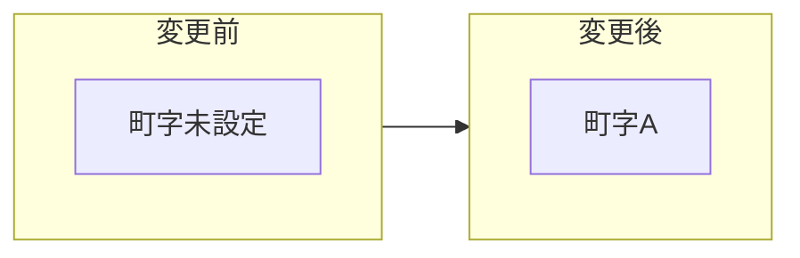

| 町字A | 町字ID     | 新規IDを付番           |
|-------|------------|------------------------|
|       | 効力発生日 | 変更実施日の日付を収録 |

1つの町字の区域内の一部を新たな町字として画定

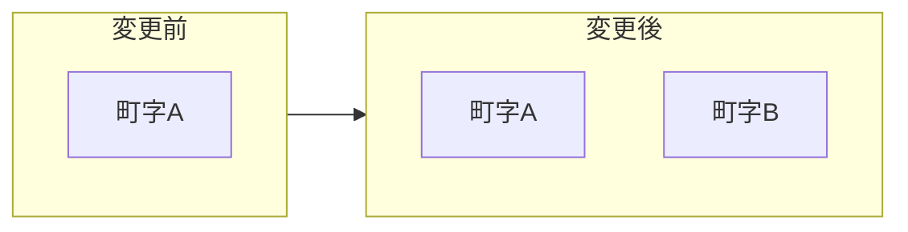

| 町字A | 町字ID     | 変更前のIDを継承                   |
|-------|------------|------------------------------------|
|       | 効力発生日 | 変更しない　（ポリゴン形状は変更） |
| 町字B | 町字ID     | 新規IDを付番                       |
|       | 効力発生日 | 変更実施日の日付を収録             |

複数の町字の区域内の一部を新たな町字として画定

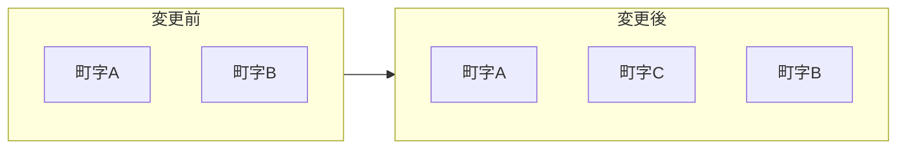

| 町字A | 町字ID     | 変更前のIDを継承                   |
|-------|------------|------------------------------------|
|       | 効力発生日 | 変更しない　（ポリゴン形状は変更） |
| 町字B | 町字ID     | 変更前のIDを継承                   |
|       | 効力発生日 | 変更しない　（ポリゴン形状は変更） |
| 町字C | 町字ID     | 新規IDを付番                       |
|       | 効力発生日 | 変更実施日の日付を収録             |

複数の町字の全域を含む新たな町字を画定

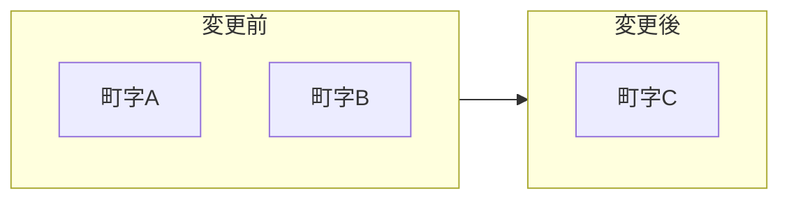

| 町字A | 町字ID     | 変更なし（過去レコード保持の場合）               |
|-------|------------|--------------------------------------------------|
|       | 廃止日     | 廃止実施日の日付を収録（過去レコード保持の場合） |
| 町字B | 町字ID     | 変更なし（過去レコード保持の場合）               |
|       | 廃止日     | 廃止実施日の日付を収録（過去レコード保持の場合） |
| 町字C | 町字ID     | 新規IDを付番                                     |
|       | 効力発生日 | 画定実施日の日付を収録                           |

②区域の廃止（全部または一部）

町字の区域内の一部が消滅 (水域に変化した等)

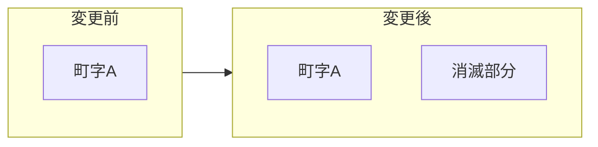

| 町字A | 町字ID     | 変更前のIDを継承                   |
|-------|------------|------------------------------------|
|       | 効力発生日 | 変更しない　（ポリゴン形状は変更） |

町字の区域内の全部が消滅 (水域に変化した等)

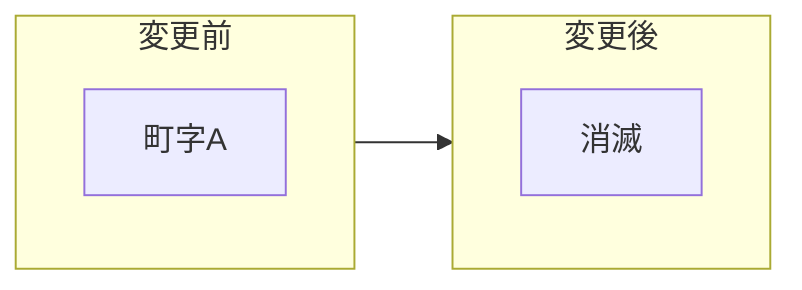

| 町字A | 町字ID | 変更なし（過去レコード保持の場合）               |
|-------|--------|--------------------------------------------------|
|       | 廃止日 | 廃止実施日の日付を収録（過去レコード保持の場合） |

③区域の変更

町字に従来町字未設定だった区域（新たに生じた土地等）を編入

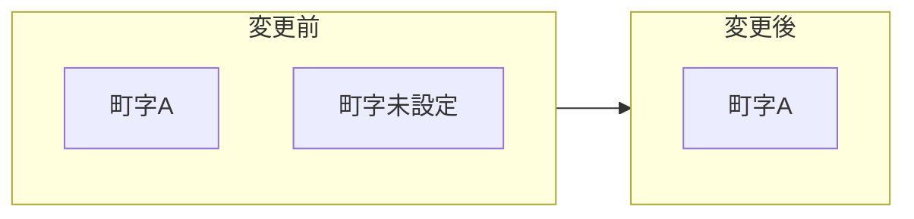

| 町字A | 町字ID     | 変更前のIDを継承                   |
|-------|------------|------------------------------------|
|       | 効力発生日 | 変更しない　（ポリゴン形状は変更） |

町字が他の町字の区域内の一部を編入

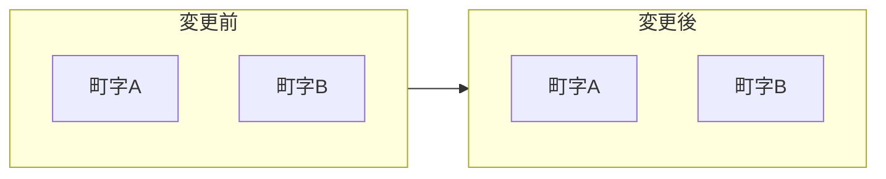

| 町字A | 町字ID     | 変更前のIDを継承                   |
|-------|------------|------------------------------------|
|       | 効力発生日 | 変更しない　（ポリゴン形状は変更） |
| 町字B | 町字ID     | 変更前のIDを継承                   |
|       | 効力発生日 | 変更しない　（ポリゴン形状は変更） |

町字が他の町字の区域内の全部を編入

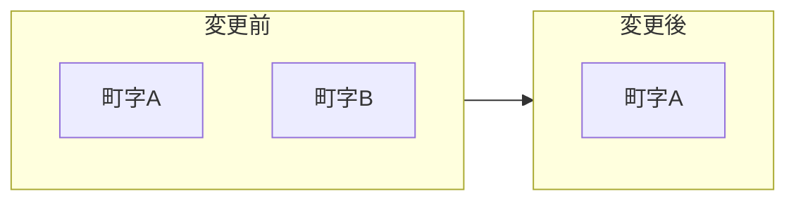

| 町字A | 町字ID     | 変更前のIDを継承                                 |
|-------|------------|--------------------------------------------------|
|       | 効力発生日 | 変更しない　（ポリゴン形状は変更）               |
| 町字B | 町字ID     | 変更なし（過去レコード保持の場合）               |
|       | 効力発生日 | 廃止実施日の日付を収録（過去レコード保持の場合） |

④名称の変更

町字の名称を変更

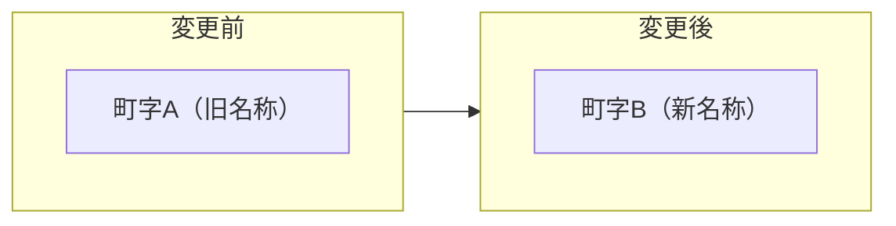

| 町字A | 町字ID     | 変更なし（過去レコード保持の場合）               |
|-------|------------|--------------------------------------------------|
|       | 大字・町名 | 町字A の名称                                     |
|       | 丁目名     |                                                  |
|       | 小字名     |                                                  |
|       | 効力発生日 | 変更実施日の日付を収録（過去レコード保持の場合） |
| 町字B | 町字ID     | 変更前のIDを継承                                 |
|       | 大字・町名 | 町字B の名称                                     |
|       | 丁目名     |                                                  |
|       | 小字名     |                                                  |
|       | 効力発生日 | 変更実施日の日付を収録                           |

⑤住居表示の実施

町字の全域で住居表示の実施（区域の画定または区域の変更、かつ/または名称の変更を伴う場合がある）

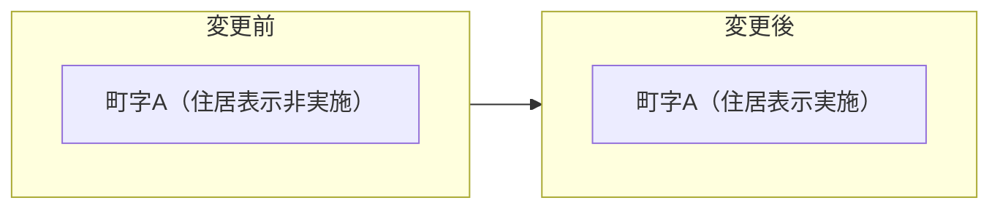

| 町字A ※旧レコード | 町字ID | 変更なし（過去レコード保持の場合） |
|---|---|---|
| 住居表示フラグ | 0(住居表示非実施) |  |
| 廃止日 | 変更実施日の日付を収録（過去レコード保持の場合） |  |
| 町字A ※新レコード | 町字ID | 変更前のIDを継承 |
| 住居表示フラグ | 1(住居表示実施) |  |
| 効力発生日 | 変更実施日の日付を収録 |  |

町字の区域内の一部で住居表示の実施

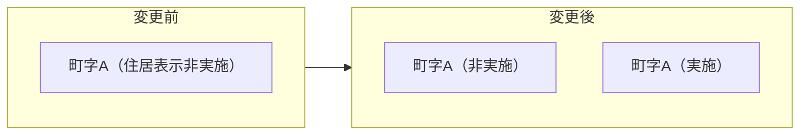

| 町字A ※住居表示未実施 | 町字ID | 変更前のIDを継承 |
|---|---|---|
| 住居表示フラグ | 0(住居表示非実施) |  |
| 効力発生日 | 変更しない　（ポリゴン形状は変更） |  |
| 町字A ※住居表示実施 | 町字ID | 変更前のIDを継承 |
| 住居表示フラグ | 1(住居表示実施) |  |
| 効力発生日 | 変更実施日の日付を収録 |  |

⑥上位階層の変更

市制施行による全国地方公共団体コード・市区町村名等の変更（町字レベルの変更はなし）

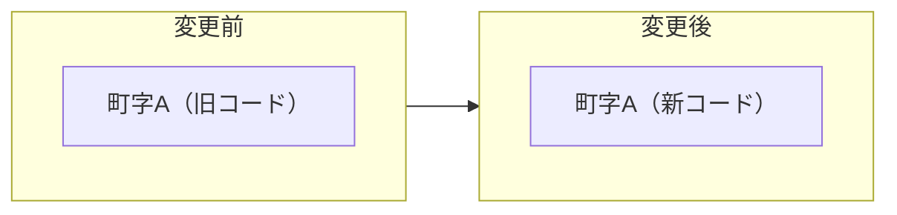

| 町字A ※旧レコード | 全国地方公共団体コード | 変更なし（過去レコード保持の場合） |
|---|---|---|
| 町字ID | 変更なし（過去レコード保持の場合） |  |
| 廃止日 | 変更実施日の日付を収録（過去レコード保持の場合） |  |
| 町字A ※新レコード | 全国地方公共団体コード | 新規に付与される |
| 町字ID | 新規IDを付番（旧町字IDを継承してもよい） |  |
| （市区町村レベル各名称項目） | 変更後の各名称を収録 |  |
| 効力発生日 | 変更実施日の日付を登録 |  |

町制施行（村→町）による市区町村名の変更（町字レベルの変更はなし）

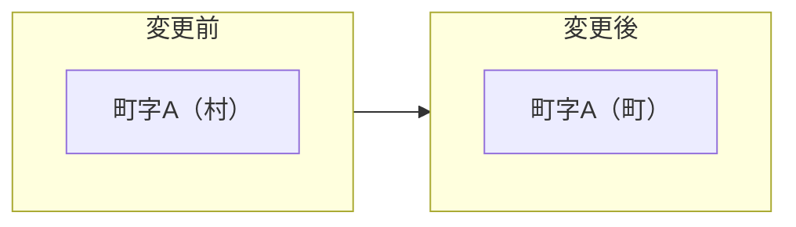

| 町字A ※旧レコード | 全国地方公共団体コード | 変更なし（過去レコード保持の場合） |
|---|---|---|
| 町字ID | 変更なし（過去レコード保持の場合） |  |
| 効力発生日 | 変更実施日の日付を収録（過去レコード保持の場合） |  |
| 町字A ※新レコード | 全国地方公共団体コード | 変更なし |
| 町字ID | 変更なし |  |
| （市区町村レベル各名称項目） | 変更後の各名称を収録 |  |
| 効力発生日 | 変更実施日の日付を収録 |  |

市町村合併または政令指定都市移行で全国地方公共団体コード等の変更

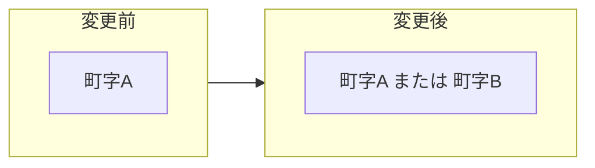

| 町字A ※旧レコード | 全国地方公共団体コード | 変更なし（過去レコード保持の場合） |
|---|---|---|
| 町字ID | 変更なし（過去レコード保持の場合） |  |
| 廃止日 | 変更実施日の日付を収録（過去レコード保持の場合） |  |
| 町字A ※新レコード | 全国地方公共団体コード | 新規に付与される |
| 町字ID | 新規IDを付番　（市区町村区域分割時等可能な場合は旧町字IDを継承してもよい） |  |
| （市区町村レベル各名称項目） | 変更後の各名称を収録 |  |
| 大字・町名 | 変更なし　又は　町字A から 町字B に変更　（合併時に区域を変更せず旧行政名を付加するケース等あり） |  |
| 丁目名 |  |  |
| 小字名 |  |  |
| 効力発生日 | 変更実施日の日付を登録 |  |

## 【付属資料２】住所・所在地の異動に係る行政の業務

### 町字レベルの住所・所在地の異動

#### 町字とは？住居表示とは？

- 総務省として住所の集約は行っていない。

- 町字の区域・名称の新設（画定）・廃止・変更は、地方自治法第260条による。告示義務を規定。

- 住居表示は、住居表示に関する法律による。告示義務を規定。町字の区域の全部又は一部に対して住居表示が実施される（一般的な街区方式の場合）。

- 自治体（市町村）が実施する。

- 町字の明確な定義は存在しない。

- 大字と（小）字の区分に関して、大字は明治の大合併（市制町村制）の際にそれ以前の旧町村名が付けられたものである。

（参考）市町村数の変遷と明治・昭和の大合併の特徴（総務省）

<https://www.soumu.go.jp/gapei/gapei2.html>

> 「明治の大合併」
> 　近代的地方自治制度である「市制町村制」の施行に伴い、行政上の目的（教育、徴税、土木、救済、戸籍の事務処理）に合った規模と自治体としての町村の単位（江戸時代から引き継がれた自然集落）との隔たりをなくすために、町村合併標準提示（明治21年 6月13日 内務大臣訓令第352号）に基づき、約300～500戸を標準規模として全国的に行われた町村合併。結果として、町村数は約5分の1に。

（参考）町村合併標準（明治21年 6月13日 内務大臣訓令第352号）[^14]

> 第六条
> 合併ノ町村ニハ新ニ其名称を選定スヘシ、旧町村ノ名称ハ大字トシテ之ヲ存スルコトヲ得、尤大町村ニ小町村ヲ合併スルトキハ其大町村ノ名称ヲ以テ新町村ノ名称トナシ或ハ互ニ優劣ナキ数小町村ヲ合併スルトキハ各町村ノ旧名称ヲ参互折衷スル等適宜斟酌シ勉メテ民情ニ背カサルコトヲ要ス、但町村ノ大小ニ拘ハラス歴史上著名ノ名称ハ可成保存ノ注意ヲ為スヘシ

#### 町字の区域・名称の新設・廃止・変更（地方自治法第260条）

> 地方自治法　（昭和二十二年法律第六十七号）
> https://elaws.e-gov.go.jp/document?lawid=322AC0000000067

> 第二百六十条　市町村長は、政令で特別の定めをする場合を除くほか、市町村の区域内の町若しくは字の区域を新たに画し若しくはこれを廃止し、又は町若しくは字の区域若しくはその名称を変更しようとするときは、当該市町村の議会の議決を経て定めなければならない。
> ２　前項の規定による処分をしたときは、市町村長は、これを告示しなければならない。
> ３　第一項の規定による処分は、政令で特別の定めをする場合を除くほか、前項の規定による告示によりその効力を生ずる。

（要点）

- 市町村の区域内に画する「町若しくは字（の区域）」と表現。

- 「町若しくは字」の定義を記載した条項は見当たらない。

- 告示（市町村長による）が必要なケース：

  - 区域の画定（新設）

  - 区域の廃止（全部又は一部）

  - 区域の変更

  - 名称の変更

- 地方自治法第260条は、改正により2012(H24)年4月1日から、都道府県から市町村に業務が移管されている（それ以前から条例で権限委譲しているケースもある）。  
  →現在は、都道府県のWebサイトから情報をまとめて取得できないケースが大半となっている。2012年までの情報だけ掲載された都道府県もある。

（参考） 福井県　町・字の区域・名称の変更等に係ること

<https://www.pref.fukui.lg.jp/doc/sityousinkou/azakai-menu.html>

> *なお、「地域主権改革に基づく第２次一括法による基礎自治体への権限移譲」に伴う地方自治法第２６０条の改正により、平成２４年４月１日から、町または字の区域・名称の変更等に関する事務は市町がおこなうことになりました。（平成２０年４月から、「福井県知事の権限に属する事務処理の特例に関する条例」の一部改正により既に移譲済み。）*

（参考） 内閣府　都道府県から市町村への事務・権限の移譲等

<https://www.cao.go.jp/bunken-suishin/kisojititai/kisojititai-index.html>

2011(H23)年8月26日成立

「地域の自主性及び自立性を高めるための改革の推進を図るための関係法律の整備に関する法律」（平成23年法律第105号）（第２次一括法）

> （地方自治法の一部改正）
> 第十四条　地方自治法（昭和二十二年法律第六十七号）の一部を次のように改正する。
> ＜中略＞
> 第二百六十条第一項中「政令で特別の定をする場合を除く外」を「市町村長は、政令で特別の定めをする場合を除くほか」に、「あらたに」を「新たに」に改め、「市町村長が」を削り、「これを定め、都道府県知事に届け出なければならない」を「定めなければならない」に改め、同条第二項中「届出を受理した」を「処分をした」に、「都道府県知事は、直ちに」を「市町村長は、」に改める。

#### 新たに生じた土地（地方自治法第９条の５）

> 地方自治法　（昭和二十二年法律第六十七号）
> https://elaws.e-gov.go.jp/document?lawid=322AC0000000067

> 第九条の五　市町村の区域内にあらたに土地を生じたときは、市町村長は、当該市町村の議会の議決を経てその旨を確認し、都道府県知事に届け出なければならない。
> ２　前項の規定による届出を受理したときは、都道府県知事は、直ちにこれを告示しなければならない。

（要点）

- 埋立等による新たに生じた土地は、市町村長が議会の議決を経て確認し、都道府県知事が告示する。

- その後、地方自治法第260条により「町若しくは字」が画定される。

#### 住居表示（住居表示に関する法律）

> 住居表示に関する法律　（昭和三十七年法律第百十九号）
> https://elaws.e-gov.go.jp/document?lawid=337AC0000000119

> （住居表示の原則）
> 第二条　市街地にある住所若しくは居所又は事務所、事業所その他これらに類する施設の所在する場所（以下「住居」という。）を表示するには、都道府県、郡、市（特別区を含む。以下同じ。）、区（地方自治法（昭和二十二年法律第六十七号）第二百五十二条の二十の区及び同法第二百五十二条の二十の二の総合区をいう。）及び町村の名称を冠するほか、次の各号のいずれかの方法によるものとする。
> 一　街区方式　市町村内の町又は字の名称並びに当該町又は字の区域を道路、鉄道若しくは軌道の線路その他の恒久的な施設又は河川、水路等によつて区画した場合におけるその区画された地域（以下「街区」という。）につけられる符号（以下「街区符号」という。）及び当該街区内にある建物その他の工作物につけられる住居表示のための番号（以下「住居番号」という。）を用いて表示する方法をいう。
> 二　道路方式　市町村内の道路の名称及び当該道路に接し、又は当該道路に通ずる通路を有する建物その他の工作物につけられる住居番号を用いて表示する方法をいう。

（要点）

- 住居表示には、「街区方式」と「道路方式」がある。

- 「街区方式」では、市区町村の配下として以下の階層構造により表示される。

  - 「町又は字」（名称・区域）

  - 「街区（街区符号）」

  - 「住居（住居番号）」

- 「道路方式」の適用は例外的。山形県東根市等に事例がある。[^15]

> （住居表示の実施手続）
> 第三条　市町村は、前条に規定する方法による住居表示の実施のため、議会の議決を経て、市街地につき、区域を定め、当該区域における住居表示の方法を定めなければならない。
> ２　市町村は、前項の規定により区域及びその区域における住居表示の方法を定めたときは、当該区域について、街区符号及び住居番号又は道路の名称及び住居番号をつけなければならない。
> ３　市町村は、前項の規定により街区符号及び住居番号又は道路の名称及び住居番号をつけたときは、住居表示を実施すべき区域及び期日並びに当該区域における住居表示の方法、街区符号又は道路の名称及び住居番号を告示するとともに、これらの事項を関係人及び関係行政機関の長に通知し、かつ、都道府県知事に報告しなければならない。
> ４　市町村は、第一項及び第二項に規定する措置を行なうに当たつては、住民にその趣旨の周知徹底を図り、その理解と協力を得て行なうように努めなければならない。

（要点）

- 住居表示実施の告示

  - 区域

  - 期日

  - 住居表示の方法

  - 街区符号（又は道路名称）

  - 住居番号

- 都道府県知事への報告義務がある

> （町又は字の区域の新設等の手続の特例）
> 第五条の二　市町村長（特別区の区長を含む。以下同じ。）は、第二条に規定する方法による住居表示の実施のため、地方自治法第二百六十条第一項の規定により町若しくは字の区域の新設若しくは廃止又は町若しくは字の区域若しくはその名称の変更（以下「町又は字の区域の新設等」という。）について議会の議決を経ようとするときは、あらかじめ、その案を公示しなければならない。
> ２　前項の規定により公示された案に係る町又は字の区域内に住所を有する者で市町村の議会の議員及び長の選挙権を有するものは、その案に異議があるときは、政令の定めるところにより、市町村長に対し、前項の公示の日から三十日を経過する日までに、その五十人以上の連署をもつて、理由を附して、その案に対する変更の請求をすることができる。
> ３　市町村長は、前項の期間が経過するまでの間は、住居表示の実施のための町又は字の区域の新設等の処分に関する議案を議会に提出することができない。
> ４　第二項の変更の請求があつたときは、市町村長は、直ちに当該変更の請求の要旨を公表しなければならない。
> ５　市町村長は、第二項の変更の請求があつた場合において、当該変更の請求に係る町又は字の区域の新設等の処分に関する議案を議会に提出するときは、当該変更の請求書を添えてしなければならない。
> ６　市町村の議会は、第二項の変更の請求に係る町又は字の区域の新設等の処分に関する議案については、あらかじめ、公聴会を開き、当該処分に係る町又は字の区域内に住所を有する者から意見をきいた後でなければ、当該議案の議決をすることができない。
> ７　市町村の議会は、第二項の変更の請求に係る町又は字の区域の新設等の処分に関する議案について、修正してこれを議決することを妨げない。
> ８　第二項の市町村の議会の議員及び長の選挙権を有する者とは、第一項の公示の日において選挙人名簿に登録されている者をいう。

（要点）

- 住居表示のため地方自治法第260条１項（前述）により「町若しくは字」の新設・廃止・区域変更・名称変更がある場合は、あらかじめその案を公示する必要がある。

- 案の公示後30日が経過しないと、「町若しくは字」の新設等の議案を議会に提出できない。

- 議会は「町若しくは字」の新設等の議案について公聴会を開いた後でないと議決できない。

#### 住居表示実施の手順

＜住居表示実施の手順の概要＞

1.  原案の作成  
    調査、区域や街区の案の作成  
    （住居表示に関する法律 第4条：住居表示実施の手続等は市町村の条例で定める）

2.  住居表示審議会  
    原案を審議し、市町村長へ答申  
    （住居表示に関する法律 第4条：住居表示実施の手続等は市町村の条例で定める）

3.  議会の議決（住居表示する区域・方法）  
    （住居表示に関する法律 第3条第1項）

4.  町字の区域変更案の公示  
    （住居表示に関する法律 第5条の2第1項）

5.  議会の議決と告示（町字の区域等の変更）  
    （地方自治法第260条第1項・第2項）

6.  街区符号・住居番号の決定  
    （住居表示に関する法律 第3条第2項）

7.  住居表示の告示  
    （住居表示に関する法律 第3条第3項）

（参考） 住居表示の手引（八王子市）

<https://www.city.hachioji.tokyo.jp/kurashi/kosekijumin/008/002/p004503_d/fil/jukyohyojitebiki.pdf>

（参考）　住居表示の実施経過の例（厚木市）

<https://www.city.atsugi.kanagawa.jp/machiit/kaihatsu/hyouzi/sanda-jyuukyohyouji/d046552.html>

（参考）『市町村境界変更等事務の手引』（財団法人福島県市町村振興協会）

<http://www.fksm.jp/sinko/kyoukai.pdf>

平成１７年１１月

※注：都道府県から市町村への事務・権限の移譲等の地方自治法第260条改正前

第１章 市町村境界変更

第２章 権限移譲事務の概要

第３章 町（字）の区域及び名称の変更

第４章 あらたに生じた土地の確認及びそれに伴う町（字）の変更等

第５章 住居表示

#### 告示の例 － 地方自治法第260条（住居表示の実施に伴うもの以外）

(参考) 町の区域の設定（福井市）　※土地区画整理関連

<https://www.pref.fukui.lg.jp/doc/sityousinkou/azakai-menu30_d/fil/fukui183.pdf>

（参考） 字の区域の画定（阿南市）　※新たに生じた土地

<https://www.pref.tokushima.lg.jp/file/attachment/511209.pdf>

　

#### 告示の例 － 住居表示

（参考）　住居表示における町字の区域等の変更案の公示の例（厚木市）

<https://www.city.atsugi.kanagawa.jp/machiit/kaihatsu/hyouzi/sanda-jyuukyohyouji/d042459.html>

※住居表示実施の手順の「④　町字の区域変更案の公示」

（参考）　町の区域の設定及び字の廃止の告示の例（厚木市）

<https://www.city.atsugi.kanagawa.jp/machiit/kaihatsu/hyouzi/sanda-jyuukyohyouji/d043698_d/fil/kokuji.pdf>

※住居表示実施の手順の「⑤　議会の議決と告示（町字の区域等の変更）」

（参考）　住居表示実施の告示の例（うるま市）

<https://www.city.uruma.lg.jp/sp/userfiles/U033/files/kokuji3-3.pdf>

（参考）　住居表示旧新対照表の例（厚木市）　※旧住所→新住所参照

<https://www.city.atsugi.kanagawa.jp/machiit/kaihatsu/hyouzi/sanda-jyuukyohyouji/d046552_d/fil/sandakyuushin.pdf>

（参考）　住居表示新旧対照表の例（厚木市）　※新住所→旧住所参照

<https://www.city.atsugi.kanagawa.jp/machiit/kaihatsu/hyouzi/sanda-jyuukyohyouji/d046552_d/fil/sandasinkyuu.pdf>

（参考）　住居表示新旧対照案内図の例（厚木市）

<https://www.city.atsugi.kanagawa.jp/machiit/kaihatsu/hyouzi/sanda-jyuukyohyouji/d046552_d/fil/sanda_sinkyu_annaizu.pdf>

###  　町界町名地番整理

- 住所をわかりやすく表現するために採られる手法には、住居表示と（町界）町名地番整理の２つがある。

- 町名地番整理の場合は街区方式の住居表示と同様に街区（ブロック）に対して地番（親番）を設定し、街区内の個々の土地に対して地番の支号（枝番）を設定することが認められている。

- この場合、数字を「-」でつないだ表記をされた住所の場合は両者の違いの判別は困難（住居表示の場合は「1番2号」、町名地番整理された地番の場合は「1番地の2」と表現されるケースが多い）。

- 以下に市町村のWebサイトに説明が掲載されている事例を示す。

（参考）日野市は住居表示を採用していますか。

<http://www.city.hino.lg.jp/faq/kurashi/sumai/1000713/1000723.html>

> 日野市は、住居表示に関する法律（昭和37年5月10日法律第119号）にもとづく住居表示を採用していません。
> 土地の表示（町名地番）をそのまま住所に使っています。

（参考）日野市の町名地番整理

<http://www.city.hino.lg.jp/shisei/machidukuri/chomei/1005343.html>

> *日野市では、町名が混在していたり、地番が複雑になっている地区及び土地区画整理事業が終了する地区を対象に町名地番整理を進めています。*

（参考）川越市　町名地番整理とは

<https://www.city.kawagoe.saitama.jp/shisei/toshi_machizukuri/machizukuri/chomeichiban/chomeichiban_toha.html>

> 町名地番整理とは、町名地番が混乱している区域の町名及び地番を変更し、住所等をわかりやすくする事業です。
> なお、川越市では住居表示ではなく、町名地番整理を実施しております。

（参考）稲城市　住所整理事業とは

<https://www.city.inagi.tokyo.jp/smph/shisei/machi_zukuri/juushoseiri/juushoseirijigyou.html>

> 現在の稲城市の住所、所在地の表示方法は、土地の番号である地番を使用しています。
> 地番は元々、人の居住場所を知るために設けられたものでなく、主に徴税を目的として明治時代に土地につけられた番号です。
> そのため、土地の分合筆や道路整備等が行われるたびに番号の規則性が失われ、番号が飛んでいる、同じ地番に多くの家が建っている等、大変わかりにくい状況になっています。
> このような状況を解消するために、わかりやすい住所、所在地の表示への整理を進めています。

（参考）戸田市　住所整理事業

<https://www.city.toda.saitama.jp/soshiki/271/tosikei-k-three-zyuukyo.html>

> 住所整理とは
> 住所が連続していない地域では、道案内や通報の際、場所の伝達に苦労をおかけすることがあります。また、緊急車両や配送車両を運転する方は、迅速に場所を特定するのに苦慮しています。
> このような状況を解消するため、住所の番号を順序よく整理し、わかりやすくする事業として住所整理事業を行っています。
> 住所整理の手法
> 住所整理の手法には、土地の番号を振りなおす「町界町名地番整理」と建物の位置で住所を付ける「住居表示」のふたつの手法があります。
> 戸田市での住所整理の実施状況は以下のとおりです。
> 戸田市内住所整理実施状況図 [PDFファイル／672KB]

※戸田市は町名地番整理と住居表示を併用。

- なお、町名地番整理の場合は地番をそのまま住所の表示に使用するが、住所の表示は「番地」、土地の地番は「番」と表現される違いを説明している資料がある。

（参考）川越市　町名地番整理について

<https://www.city.kawagoe.saitama.jp/shisei/toshi_machizukuri/machizukuri/chomeichiban/pamphlet.files/chomeipamphlet202006.pdf>

> 住所・本籍　　川越市元町１丁目３番地１
> 土地の地番　　川越市元町１丁目３番１

（参考）稲城市住所整理事業

<https://www.city.inagi.tokyo.jp/shisei/machi_zukuri/juushoseiri/juushoseirijigyou.files/pamphlet.pdf>

> 住　　　所　　稲城市東長沼一丁目１番地の１
> 土地の地番　　稲城市東長沼一丁目１番１

#### その他

（参考）なぜ、堺市では美原区域以外は「丁目」じゃなくて「丁」なの？

<https://www.city.sakai.lg.jp/kurashi/jutaku/jutaku/jukyohyoji/cho.html>

### 地番の異動

#### 地番の異動が生じるケース

- 地番の新設・廃止や、地番の区域の変更は、必ず不動産登記法に基づく土地の表題部に関する登記が行われる。

- 表題登記（新たに生じた土地等）、土地の滅失の登記、分筆・合筆の登記等がある。

- 面的に異動が生じるケースとしては、土地改良事業（土地改良法（昭和24年法律第195号）、土地区画整理事業（土地区画整理法（昭和29年法律第119号））、市街地再開発事業（昭和44年法律第38号）等がある。

- 住所整理事業で、住居表示によらない手法として町界町名地番整理（地方自治法第260条）がある（１０.１8) 町界町名地番整理）。町の区域をわかりやすく設定した後に、土地の地番を順序よく振り直すもの。

- 地番に対応する一筆の土地の形状に関する情報は、登記所備付地図又は公図として記録される。

#### 不動産登記

> 不動産登記法
> https://elaws.e-gov.go.jp/document?lawid=416AC0000000123

（要点－全般）

- 不動産とは、土地又は建物をいう　（不動産登記法第２条第１号）

- 登記記録のうち表示に関する登記が記録される部分を表題部、権利に関する登記が記録される部分を権利部という （不動産登記法第２条第７号及び第８号）

（要点－土地の登記）

- 登記記録は、一筆の土地又は一個の建物ごとに作成される。（不動産登記法第２条第５号）

- 土地の表示に関する登記の登記事項に、土地の所在する市区郡町村及び字と地番が含まれる。（不動産登記法第34条）

- 地番とは、地番区域（地番を付すべき区域）を定め、一筆の土地ごとに付す番号をいう。（不動産登記法第35条及び第２条第17号（定義））

- 土地の表題登記（表示に関する登記のうち表題部に最初にされる登記－新たに生じた土地、表題登記がない土地の所有権の取得）　（不動産登記法第36条及び第２条第20号（定義））

- 分筆・合筆の登記　（不動産登記法第39条）

- 土地の滅失の登記　（不動産登記法第42条）

- 登記所には、「地図」（登記所備付地図(14条地図)）及び建物所在図を備え付ける。各土地の区画を明確にし、地番を表示する。地図が備え付けられるまでの間、これに代わるものとして「地図に準ずる図面」（公図）を備え付けることができる。　（不動産登記法第14条）

> 不動産登記規則
> https://elaws.e-gov.go.jp/document?lawid=417M60000010018

（要点－土地の登記）

- 地番区域は市、区、町、村、字又はこれに準ずる地域をもって定める。（不動産登記規則第97条）

- 地番は地番区域ごとに起番して定める。（不動産登記規則第98条）

- 地番区域が大字・町の場合は小字（ある場合）の表記を省略しても地番は一意に決まるが、地番区域が小字の場合は小字の表記を省略できない（同一大字内に同じ地番の重複がある）。

（参考）不動産登記のABC （法務省）

<http://www.moj.go.jp/MINJI/minji02.html>

> 不動産登記とは？
> 　不動産登記は，わたしたちの大切な財産である土地や建物の所在・面積のほか，所有者の住所・氏名などを公の帳簿（登記簿）に記載し，これを一般公開することにより，権利関係などの状況が誰にでもわかるようにし，取引の安全と円滑をはかる役割をはたしています。
> 登記記録（登記簿）とは？
> １ 　登記簿は磁気ディスクをもって調製されています。登記所では，所定の請求書を提出すると，だれでも登記事項証明書（登記事項の全部又は一部を証明した書面。）の交付を受けることができ，また，だれでも登記事項要約書（登記事項の概要を記載した書面）の交付を受けることができます。
> ２ 　登記記録は，１筆（１区画）の土地又は１個の建物ごとに表題部と権利部に区分して作成されています。さらに，権利部は甲区と乙区に区分され，甲区には所有権に関する登記の登記事項が，乙区には所有権以外の権利に関する登記の登記事項がそれぞれ記録されています。
> (1)　 表題部の記録事項
> 土地・・・所在，地番，地目（土地の現況），地積（土地の面積）など
> 建物・・・所在，地番，家屋番号，種類，構造，床面積など （表題部にする登記を「表示に関する登記」といいます。）
> 　マンションなどの区分建物については，その建物の敷地に関する権利（敷地権）が記録される場合があります。この敷地権についての権利関係は，区分建物の甲区，乙区の登記によって公示されます。
> (2)　権利部（甲区）の記録事項 　所有者に関する事項が記録されています。その所有者は誰で，いつ，どんな原因（売買，相続など）で所有権を取得したかが分かります（所有権移転登記，所有権に関する仮登記，差押え，仮処分など）。
> (3)　権利部（乙区）の記録事項 　抵当権など所有権以外の権利に関する事項が記録されています（抵当権設定，地上権設定，地役権設定など）。

（要点）

- 土地の登記記録の表題部の情報を集約することにより、地番の実在情報（レコード）は得ることができる。

- その地番がどこの土地を指すものかについては、別掲の地図（登記所備付地図）・地図に準ずる図面（公図）による。

資料 １０‑1　不動産登記のABC （法務省）より引用

（参考）地番の定め方 （不動産登記事務取扱手続準則第67条）

<https://ja.wikibooks.org/wiki/%E4%B8%8D%E5%8B%95%E7%94%A3%E7%99%BB%E8%A8%98%E4%BA%8B%E5%8B%99%E5%8F%96%E6%89%B1%E6%89%8B%E7%B6%9A%E6%BA%96%E5%89%87%E7%AC%AC67%E6%9D%A1>

> （地番の定め方）
> 第67条
> １．地番は，規則第98条に定めるところによるほか，次に掲げるところにより定めるものとする。
> 一　地番は，他の土地の地番と重複しない番号をもって定める。
> 二　抹消，滅失又は合筆により登記記録が閉鎖された土地の地番は，特別の事情がない限り，再使用しない。
> 三　土地の表題登記をする場合には，当該土地の地番区域内における最終の地番を追い順次にその地番を定める。
> 四　分筆した土地については，分筆前の地番に支号を付して各筆の地番を定める。ただし，本番に支号のある土地を分筆する場合には，その1筆には，従来の地番を存し，他の各筆には，本番の最終の支号を追い順次支号を付してその地番を定める。
> 五　前号本文の規定にかかわらず，規則第104条第6項に規定する場合には，分筆した土地について支号を用いない地番を存することができる。
> 六　合筆した土地については，合筆前の首位の地番をもってその地番とする。
> 七　特別の事情があるときは，第3号，第4号及び第6号の規定にかかわらず，適宜の地番を定めて差し支えない。
> 八　土地区画整理事業を施行した地域等においては，ブロック（街区）地番を付して差し支えない。
> 九　地番の支号には，数字を用い，支号の支号は用いない。
> ２．登記官は，従来の地番に数字でない符号又は支号の支号を用いたものがある場合には，その土地の表題部の登記事項に関する変更の登記若しくは更正の登記又は土地の登記記録の移記若しくは改製をする時に当該地番を変更しなければならない。ただし，変更することができない特段の事情があるときは，この限りでない。
> ３．登記官は，同一の地番区域内の2筆以上の土地に同一の地番が重複して定められているときは，地番を変更しなければならない。ただし，変更することができない特段の事情があるときは，この限りでない。
> ４．地番が著しく錯雑している場合において，必要があると認めるときは，その地番を変更しても差し支えない。

（要点）

- 地番は数字とするのが原則だが、従来の地番には数字でないものが存在しうることが示唆されている。その場合、変更の登記等に合わせて数字の地番に変更される。

- 支号（枝番）の支号（枝番）は用いないのが原則だが、従来の地番には支号の支号を用いたものが存在しうることが示唆されている。その場合、変更の登記等に合わせて支号の支号がない地番に変更される。

（参考）登記所の地図には どのようなことが記載されているのですか？　（法務局）

<http://houmukyoku.moj.go.jp/homu/content/000130963.pdf>

> １ 登記所には，どのような地図が備え付けられているのですか。
> 登記所には，大きく分けて，次の２種類の地図が備え付けられています。
> ① 地図（法第１４条第１項）
> 　不動産登記法第１４条第１項の規定によって，登記所に備え付けることとされている地図で精度の高い調査・測量の成果に基づいて作成されたものです。
> 　精度が高い地図ですが，備付けが完了していない地域もあります。
> ② 地図に準ずる図面（法第１４条第４項，いわゆる公図）
> 　①の地図（法第１４条第１項）が備え付けられるまでの間，これに代わって登記所に備え付けることとされている図面で，土地の位置，形状及び地番を表示しているものです。
> 　これらの図面の大部分は，明治時代に作成された旧土地台帳附属地図（いわゆる公図）で，昭和２５年以降に税務署から登記所に移管されたものであり，①の地図（法第１４条第１項）と比べると，精度が劣っています。
> ２ 地図には，どのような事項が記録されているのですか。
> 　地図は，登記されている土地が，現地のどこにあって（位置 ，どのような形）をしていて（形状，区画 ，隣接している土地の地番は何番かを表すために，一筆又は数筆の土地ごとに作成されています。
> 　地図には，
> 　(1)地番区域の名称「東京都千代田区霞が関一丁目」など
> 　(2)地図（各図郭）の番号 地図にはそれぞれ固有の番号が付されています。この地図番号は，登記記録の表題部にも記録されています。
> 　(3)縮尺
> 　(4)平面直角座標系の番号又は記号
> 　(5)図郭線及びその座標値
> 　(6)各土地の区画及び地番
> 　(7)基本三角点等の位置
> 　(8)精度区分
> 　(9)隣接図郭との関係
> 　(10)作成年月日
> 　が記録されています。
> 　なお，地図に準ずる図面の大部分は，明治時代に作成された旧土地台帳附属地図（いわゆる公図）であるため，上記の事項の全ては表示されておらず，また，土地の形状が現地と一致していないものもあります。このような地図に準ずる図面は，登記された土地のおおよその位置，地番とその隣接関係を表示しているものとお考えください。
> 　このほか，紛争等のために隣接地との筆界が不明確な土地については，地図に筆界を表示せずに，そのような土地の地番を並列するなどの方法で表示しているものも一部あります。

（要点）

- 登記所備付地図が整備されている場合、土地の区画（地番の区域）の図形情報が座標（緯度経度）付きで存在する。

- 登記所備付地図が整備されていない場合、公図しかないため正確な座標情報は存在しない。

> 土地家屋調査士法　（昭和25年法律第228号）
> https://elaws.e-gov.go.jp/document?lawid=325AC1000000228

（参考）　土地家屋調査士の業務　（法務省）

<http://www.moj.go.jp/MINJI/minji117.html>

（参考）　土地家屋調査士について　（日本土地家屋調査士会連合会）

<https://www.chosashi.or.jp/investigator/about/>

> 土地家屋調査士の業務
> (1) 不動産の表示に関する登記につき必要な土地又は家屋に関する調査及び測量をすること。
> (2) 不動産の表示に関する登記の申請手続について代理すること。
> (3) 不動産の表示に関する登記に関する審査請求の手続について代理すること。
> (4) 筆界特定の手続について代理すること。
> (5)　土地の筆界が明らかでないことを原因とする民事に関する紛争に係る民間紛争解決手続について代理すること。
> ※ (1)～(5)の事務に関して，相談に応じること等も，業務に含まれる。

（要点）

- 不動産登記に必要な調査・測量は土地家屋調査士が行っている。

- 例えば、土地の分筆登記であれば、登記所に備え付けられた地図や地積測量図等の資料、現地の状況や隣接所有者の立会い等を得て公法上の筆界を確認し、その成果に基づき測量をする。

（参考）登記所備付地図作成作業　（法務省）

<http://www.moj.go.jp/MINJI/minji05_00236.html>

（参考）登記所備付地図整備事業の推進　（法務省）

<http://www.moj.go.jp/MINJI/minji05_00231.html>

> 全国の法務局・地方法務局においては，「民活と各省連携による地籍整備の推進」（平成１５年６月２６日都市再生本部決定）の方針を踏まえ，全国の都市部の人口集中地区（ＤＩＤ）の地図混乱地域を対象に，登記所備付地図[注3]作成作業を計画的に実施しています。
> 　 しかし，地価が高額であるなどといった理由により大都市の枢要部や地方の拠点都市の地図の整備は進んでいません。また，東日本大震災の被災県においても，復興の進展に伴い地図の整備が求められています。
> 　 そこで，法務省民事局では，登記所備付地図の整備の更なる推進を図るため，従来の計画を見直し，平成２７年度を初年度とする，(1)「登記所備付地図作成作業第２次１０か年計画」，(2)「大都市型登記所備付地図作成作業１０か年計画」及び(3)「震災復興型地図作成作業３か年計画」を策定し，作業面積を拡大して実施することとしました。
> 　 なお，個々の登記所備付地図作成作業は，２年単位で実施しております。
> 注３
> 登記所備付地図とは，不動産登記法（平成１６年法律第１２３号）第１４条第１項の規定に基づき，登記所に備え付けられる地図のことをいい，これにより，各土地の位置及び区画（筆界（境界））を明確にすることができます。
> なお，登記所備付地図が備え付けられるまでの間，これに代えて，地図に準ずる図面（公図）が備え付けられています（同条第４項）が，公図は，明治期の地租改正の際に作成されたものが多く，現地を復元するほどの精度と正確性は有していません。

（要点）

- 登記所備付地図の整備は、都市部において整備が遅れている。

（参考）地図情報システムで取り扱う地図情報のデータ形式について

<http://www.moj.go.jp/MINJI/minji05_00171.html>

> 地図情報システムは，登記所に備え付けられている地図及び地図に準ずる図面等を電子情報として管理し，コンピュータシステムによる事務の処理を可能とするシステムです。
> 地図情報システムで取り扱われている地図及び地図に準ずる図面のデータ形式は，以下のとおりです。
> 法務省フォーマット
> http://www.moj.go.jp/content/000116463.pdf
> 地図ＸＭＬフォーマット
> http://www.moj.go.jp/content/000116464.pdf

筆データ

フィールドフォーマット

| No. | 項目       | 説明 | 型     | サイズ | 例  |
|-----|------------|------|--------|--------|-----|
| 1   | 大字コード |      | 文字列 | 3      |     |
| 2   | 丁目コード |      | 文字列 | 3      |     |
| 3   | 小字コード |      | 文字列 | 4      |     |
| 4   | 予備コード |      | 文字列 | 2      |     |
| 5   | 大字名     |      | 文字列 |        |     |
| 6   | 丁目名     |      | 文字列 |        |     |
| 7   | 小字名     |      | 文字列 |        |     |
| 8   | 予備名     |      | 文字列 |        |     |
| 9   | 地番       |      | 文字列 |        |     |
|     | （以下略） |      |        |        |     |

※法務省フォーマット、地図XMLフォーマットで要素は共通

（要点）

- 表題部の登記における「所在」（地番の上位階層の行政区画を示す）のうち町字が「大字」「丁目」「小字」に区分されている。

- 任意座標（緯度・経度や平面直角座標に対応がつかない座標）で整備されている場合や、方位、縮尺不明の場合がある。

#### 地籍調査

> 国土調査法　（昭和26年法律第180号）
> https://elaws.e-gov.go.jp/document?lawid=326AC0000000180

> 国土調査法施行令　（昭和27年政令第59号）
> https://elaws.e-gov.go.jp/document?lawid=327CO0000000059

（参考）地籍調査Webサイト　（国土交通省）

<http://www.chiseki.go.jp/>

（参考）地籍調査とは？　（国土交通省）

<http://www.chiseki.go.jp/about/point/index.html>

> 地籍調査とは、主に市町村が主体となって、一筆ごとの土地の所有者、地番、地目を調査し、境界の位置と面積を測量する調査です。「地籍」とは、いわば「土地に関する戸籍」のことです。各個人には固有の「戸籍」という情報があり、様々な行政場面で活用されているのと同様に、土地についても「地籍」の情報が行政の様々な場面で活用されています。
> 我が国では、土地に関する記録は登記所において管理されていますが、土地の位置や形状等を示す情報として登記所に備え付けられている地図や図面は、その半分ほどが明治時代の地租改正時に作られた地図(公図)などをもとにしたものです。そのため登記所に備え付けられている地図や図面は、境界や形状などが現実とは異なっている場合が多くあり、また、登記簿に記載された土地の面積も、正確ではない場合があるのが実態です。
> 地籍調査が行われることにより、その成果は登記所にも送られ、登記簿の記載が修正され、地図が更新されることになります。また、固定資産税算出の際の基礎情報となるなど、市町村における様々な行政事務の基礎資料として活用されます。
> なお、地籍調査は、国土調査法に基づく「国土調査」の1つとして実施されています。

（要点）

- 地籍調査の成果の写しは登記所に送付される。（国土調査法第20条）

- 登記所に送付された地籍図は登記完了後に地図として備え付ける。（不動産登記規則第10条第５項）

（参考）地籍整備の推進に関する政策評価　政策評価書　（総務省）

<https://www.soumu.go.jp/menu_news/s-news/01hyoka02_191206000137696.html>

（第3　政策効果の把握の結果　　8　法務局・地方法務局との連携状況）

<https://www.soumu.go.jp/main_content/000657953.pdf>

> 全国の登記所に備え付けられている地図・図面の現状は、図表8-(1)-ア-②のとおり、平成30 年 4 月 1 日現在、約722 万枚の地図・図面が備え付けられており、このうち登記所備付地図は約407 万枚（56.4％）で、残りの約315 万枚（43.6％）が公図となっている。 登記所備付地図の内訳をみると、地籍調査による地籍図が約301万枚（74.0％）となっており、このほか、土地改良図等の土地所在図等が約104万枚（25.6％）、法務局等作成地図が約2.4 万枚（0.6％）となっている。

（要点）

- 地図・図面のうち登記所備付地図は56％（2018年時点）。

- 登記所備付地図のうち地籍調査によるものが74%（2018年時点）。

（参考）公図と現況のずれ Q&A　（国土交通省）

<http://gaikuchosa.mlit.go.jp/gaiku/html/info4.html>

> Q3：公図と現況のずれは、どのように調査したのですか。
> A：国土交通省においては、平成16年度から18年度にかけ都市再生街区基本調査を実施し、市区町から収集した情報及び現地踏査を元に、公図の角の点に対応すると考えられる現地の点の位置を測量しています。
> これらの点を基準として、できるだけ差が小さくなるように公図と現況図を重ねたときの乖離を「ずれ」と表現しています。
> この「ずれ」の値は、現在の公図が正しい地図を作るためにどの程度有用であるかの目安を示すものです。現地で測量した点は土地の所有者に筆界であることを確認した点ではありません。また、一筆ごとの土地それぞれについて公図とのずれを示す目的で作業をしたものでもありませんので、ご利用にあたってはご留意ください。

> Q8：全国的な公図と現況のずれはどのような傾向になっているのですか。
> A：公図と現況のずれの傾向は下表の通りです。

（要点）

- 公図の精度について、都市再生街区基本調査（2004～06年に人口集中地区(DID)の地籍調査が行われていない地域全域に対して実施）の結果として、大きなずれ（ずれが1m以上）のある地域が50%以上。

（参考）都市再生街区基本調査　（国土交通省　地籍調査Webサイト）

<http://www.chiseki.go.jp/plan/cityblock/index.html>

> 都市再生街区基本調査とは、都市部の地籍調査を推進するための基礎的データを整備するために、平成16～18年度に国が実施した基本調査です。
> 一筆ごとの土地について所有者、地番、地目、境界及び面積を調査する地籍調査は、土地の境界を明確にし、土地取引による経済活動全体の円滑化・活性化につながり、公共事業などを円滑に進めるためにも早期に取り組むことが必要です。
> しかし、調査には多くの労力と時間がかかり、特に都市部では土地の権利関係が複雑なため調査が遅れています(調査開始時点(平成16年度末)における進捗率：全国46％、都市部19％))。このような都市部の地籍整備の状況を改善し、都市開発事業や公共事業の円滑化・迅速化及び安心のできる土地取引の基盤づくりを進めていくことが都市再生を推進する上できわめて重要です。また、平成15年6月の都市再生本部会合において、全国の都市部における地籍整備を推進するため、関係省庁が協力して推進するよう指示がありました。
> これらを踏まえて、全国の都市部における地籍整備の推進を図ることを目的として、地籍調査のための基礎的調査を実施する「都市再生街区基本調査」が行われました。

## 【付属資料３】現状入手可能な無償・有償の住所データ

### 住所データ概観

#### 住所データ／概観

市区町村

町字

[大字町丁目]

街区符号

（住居表示区域）

住居番号

(住居表示区域)

＋地番

(非住居表示)

地番

(住居表示区域)

マスター
代表点
ポリゴン
マスター
代表点
ポリゴン
マスター
代表点
ポリゴン
マスター
代表点
ポリゴン
マスター
代表点
ポリゴン

全国地方公共団体コード・JIS

（総務省）

◎

全国町・字ファイル

(国土地理協会/J-LIS)

◎

日本行政区画便覧ファイル

(日本加除出版)

◎

◎

大字・町丁目レベル位置参照情報

(国土交通省)

◎
○

街区レベル位置参照情報

(国土交通省)

○
○

基盤地図情報

(国土地理院)

○
○
○
○
○

線

のみ

国勢調査・小地域-町丁・字等別

(総務省統計局)

○

○

電子国土基本図（地名情報） 居住地名

（国土地理院）

○
○

電子国土基本図（地名情報）「住居表示住所」

（国土地理院）

住居番号のみ
住居番号のみ

不動産登記

登記所備付地図

（法務省）

地番のみ

○

不動産登記

公図

（法務省）

民間地図会社
◎
○
○
◎
○
○
◎
○
※
◎
○

民間地図会社

(ゼンリン／NTT)

◎
○
※

＜凡例＞

◎：コード化されたマスターデータあり

○：コード化されていないマスターデータあり／位置情報（代表点・ポリゴン）の収録あり

※：収録の有無が異なる

【参考メモ】

- 位置情報（緯度経度座標）の整備には「代表点」と「ポリゴン」がある。  
  代表点　：1地点の緯度経度座標を持つ。位置の検索等に使える。  
  ポリゴン：領域を多角形（各頂点に緯度経度を持つ）の面で示す。ある地点がどのポリゴンに内包するかの判定や、統計情報の集計等に使える。  
  ※なお、境界線を「線（ライン）」で持っている場合、表示用には使えても、集計等の用途には使えない。

- 住居表示実施区域は、表示用の住所（○丁目○番○号）と、不動産登記の地番の二重構造になっている。

- 住居表示非実施区域は、不動産登記の地番をそのまま住所・所在地の表示に使う。

- したがって、民間企業を中心とする住所データ（番地号レベル・位置情報付き）については、住居表示実施区域については住居表示のみの収録、住居表示非実施区域については地番の収録とする場合が主流である。

- 住居表示実施区域の不動産登記の地番は、民間地図会社のゼンリン（商品名「ブルーマップ」）、NTTインフラネット［旧：NTT空間情報］（商品名：「GEOSPACE地番地図」）が整備・提供している。自治体のWebサイトで、住居表示整備区域の地番を知るには、窓口でブルーマップを参照するように、と説明しているケースもある。

- 通称町名が普及している地域があるが、通称町名の収録有無に関しては、各社各様のポリシーに準じているようである。

#### 住所データ／大字町丁目レベル

|  | データ | 更新頻度 | 収録範囲 | 備考 |
|---|---|---|---|---|
| マスター (レコード) | 全国町・字ファイル (国土地理協会/J-LIS) | 月1回 | 全国 |  |
| 日本行政区画便覧ファイル (日本加除出版) | 月1回 | 全国 |  |  |
| 大字・町丁目レベル位置参照情報 (国土交通省国土情報課) | 年1回 | 全国 | 街区レベル位置参照情報を補完する位置付け |  |
| 基盤地図情報 (国土地理院) | 年4回 | 全国 | 位置参照情報を活用していると思われる |  |
| 国勢調査・小地域-町丁・字等別 (総務省統計局) | 5年に1回 | 全国 |  |  |
| 民間地図会社 | 年2 or 4 or 12回 | 全国 |  |  |
| 代表点 | 大字・町丁目レベル位置参照情報 (国土交通省国土情報課) | 年1回 | 全国 |  |
| 基盤地図情報 (国土地理院) | 年4回 | 全国 | 位置参照情報を活用していると思われる |  |
| 民間地図会社 | 年2 or 4 or 12回 | 全国 |  |  |
| ポリゴン | 国勢調査・小地域-町丁・字等別 (総務省統計局) | 5年に1回 | 全国 |  |
| 民間地図会社 | 年2 or 4 or 12回 | 全国 |  |  |

【参考メモ】

- 町字の明確な定義がない状況下で、長らく加除式図書である『国土行政区画総覧』（国土地理協会）や『日本行政区画便覧』（日本加除出版）が自治体における町字の一覧の拠り所とされてきた側面がある。従来は出版物（紙媒体）での提供だったが、現在はデータ提供されている（上表のとおり）。

#### 住所データ／街区レベル (主に住居表示実施区域)

|  | データ | 更新頻度 | 収録範囲 | 備考 |
|---|---|---|---|---|
| マスター (レコード) | 日本行政区画便覧ファイル (日本加除出版) | 月1回 | 全国／住居表示実施区域 | 国土地理協会と日本加除出版の違い |
| 街区レベル位置参照情報 (国土交通省国土情報課) | 年1回 | 全国／都市計画区域（住居表示非実施区域を含む） | 住居表示非実施区域においても道路等で囲まれた街区の代表点を収録 |  |
| 基盤地図情報 (国土地理院) | 年4回 | 全国 | 位置参照情報を活用していると思われる |  |
| 民間地図会社 | 年2 or 4 or 12回 | 全国 |  |  |
| 代表点 | 街区レベル位置参照情報 (国土交通省国土情報課) | 年1回 | 全国／都市計画区域（住居表示非実施区域を含む） |  |
| 基盤地図情報 (国土地理院) | 年4回 | 全国 | 位置参照情報を活用していると思われる |  |
| 民間地図会社 | 年2 or 4 or 12回 | 全国 |  |  |
| ポリゴン | 民間地図会社 | 年2 or 4 or 12回 | 全国 |  |

##  　入手可能なデータ（無償）

#### 全国地方公共団体コード／総務省

| データ名称 | 全国地方公共団体コード |
|---|---|
| 提供元 | 総務省地域力創造グループ地域情報政策室（問合せ先） |
| 提供サイトURL | https://www.soumu.go.jp/denshijiti/code.html |
| データ内容 | 市区町村レベルのマスターデータ（位置座標なし） |
| 仕様 | 全国地方公共団体コード仕様 https://www.soumu.go.jp/main_content/000137948.pdf |
| 過去情報の提供 | 「都道府県コード及び市区町村コード」改正一覧表（平成17年4月1日以降）を提供 |

データ項目

| No. | 項目 | 説明 | 型 | サイズ | 例 |
|---|---|---|---|---|---|
| 1 | 団体コード | 都道府県コード（JIS X 0401）　2桁 市区町村コード（JIS X 0402）　3桁 チェックデジット　1桁 | 文字列(数字) | 6桁 | 131016 |
| 2 | 都道府県名(漢字) |  | 文字列 | － | 東京都 |
| 3 | 市区町村名(漢字) |  | 文字列 | － | 千代田区 |
| 4 | 都道府県名(カナ) |  | 文字列 | － | ﾄｳｷｮｳﾄ |
| 5 | 市区町村名(カナ) |  | 文字列 | － | ﾁﾖﾀﾞｸ |

※都道府県コード（JIS X 0401）、市区町村コード（JIS X 0402）

<https://www.jisc.go.jp/app/jis/general/GnrJISSearch.html>　より検索

【参考メモ】

- 郡について、JIS X 0402に掲載あり、読み仮名あり、コード化されていない。総務省「全国地方公共団体コード」には掲載なし。

#### 位置参照情報／国土交通省

| データ名称 | 街区レベル位置参照情報（①） 大字・町丁目レベル位置参照情報（②） |
|---|---|
| 提供元 | 国土交通省不動産・建設経済局（2020/7/1付で国土交通省国土政策局より移管） |
| 提供サイトURL | http://nlftp.mlit.go.jp/isj/index.html |
| データ内容 | ①街区（住居表示実施区域における街区及び未実施区域における街区相当範囲(道路等で区画された範囲)）の代表点位置座標（都市計画区域内を整備） ②大字・町丁目の代表点位置座標（街区レベル位置参照情報を補完する整備） （参照）位置参照情報の説明ページ https://nlftp.mlit.go.jp/isj/index.html |
| 仕様 | 位置参照情報のデータ形式 http://nlftp.mlit.go.jp/isj/data.html |
| ライセンス情報 | 位置参照情報ダウンロードサービスコンテンツ利用規約 https://nlftp.mlit.go.jp/ksj/other/agreement.html#agree-03 2020年4月1日に改定されている。 改定により、政府標準利用規約（第2.0版）に準拠・CC BY 4.0互換となった。 |
| 更新頻度 | 年1回 |

主な特徴：

- 街区レベル位置参照情報は、市区町村・大字町丁目がコード化されていない。

- 大字・町丁目レベル位置参照情報は、市区町村・大字町丁目がコード化されている。

- 街区レベル位置参照情報は、街区レベルの代表点緯度経度を収録。住居表示非実施区域は街区相当範囲（道路等で区画された範囲）に含まれる地番を代表点に対応付けしている。

- 地名について、「国内の標準的な地名を指定しているものではありません」。

データ項目・仕様

街区レベル位置参照情報

| No. | 項目 | 説明 | 型 | サイズ | 例 |
|---|---|---|---|---|---|
| 1 | 都道府県名 |  |  |  | 福島県 |
| 2 | 市区町村名 |  |  |  | 本宮市 |
| 3 | 大字・町丁目名 |  |  |  | 岩根 |
| 4 | 小字・通称名 |  |  |  | 下桶 |
| 5 | 街区符号・地番 |  |  |  | 126 |
| 6 | 座標系番号 | 平面直角座標系の座標系番号 |  |  | 9 |
| 7 | Ｘ座標 | 平面直角座標系のX座標 メートル単位（小数第1位まで）（北方向プラス） |  |  | 164065.1 |
| 8 | Ｙ座標 | 平面直角座標系のY座標 メートル単位（小数第1位まで）（東方向プラス） |  |  | 43616.6 |
| 9 | 緯度 | 十進経緯度 度単位（小数第6位まで） |  |  | 37.477545 |
| 10 | 経度 | 十進経緯度 度単位（小数第6位まで） |  |  | 140.326492 |
| 11 | 住居表示フラグ | 1:住居表示実施、0:住居表示未実施 |  |  | 0 |
| 12 | 代表フラグ | 1:代表する、0:代表しない 街区符号・地番が複数レコードある場合 |  |  | 1 |
| 13 | 更新前履歴フラグ | 1：新規作成、2：名称変更、3：削除、0：変更なし |  |  | 0 |
| 14 | 更新後履歴フラグ | 1：新規作成、2：名称変更、3：削除、0：変更なし |  |  | 1 |

【参考メモ】

- 街区レベル位置参照情報には、小字（小字を表示しないと下層の地番がユニークにならない区域）の収録が見られるが、大字・町丁目レベル位置参照情報には該当する小字レコードの収録がない。

- 街区レベル位置参照情報では、  
  　大字・町丁目名：大字名、町名＋丁目名  
  　小字・通称名　：小字等  
  のように収録されており、「丁目」と「小字」が別階層扱い。

- 「住居表示未実施区域は街区相当範囲（道路等で区画された範囲）に含まれる地番を代表点に対応付けしている」との説明から、小字については網羅性が担保されないことが推察される。

- 街区レベル位置参照情報には、市区町村レベル・大字町丁目レベルともIDを持たない。

データ項目・仕様

大字・町丁目レベル位置参照情報

| No. | 項目 | 説明 | 型 | サイズ | 例 |
|---|---|---|---|---|---|
| 1 | 都道府県コード | JIS都道府県コード |  |  |  |
| 2 | 都道府県名 | 当該範囲の都道府県名 |  |  |  |
| 3 | 市区町村コード | JIS市区町村コード |  |  |  |
| 4 | 市区町村名 | 当該範囲の市区町村名 （郡部は郡名、政令指定都市の区名も含む） |  |  |  |
| 5 | 大字町丁目コード | 大字町丁目コード （JIS市区町村コード＋独自7桁） |  |  |  |
| 6 | 大字町丁目名 | 当該範囲の大字・町丁目名 （町丁目の数字は漢数字） |  |  |  |
| 7 | 緯度 | 十進経緯度 度単位（小数第6位まで） |  |  |  |
| 8 | 経度 | 十進経緯度 度単位（小数第6位まで） |  |  |  |
| 9 | 原典資料コード | 大字・町丁目位置参照情報作成における原典資料を表すコード 1：自治体資料　2：街区レベル位置参照　3：1/25000地形図　0：その他資料 |  |  |  |
| 10 | 大字・字・丁目区分コード | 大字/字/丁目の区別を表すコード 1：大字　2：字　3：丁目　0：不明 |  |  |  |

【参考メモ】

- 大字・町丁目レベル位置参照情報における「大字町丁目コード」のうち下７桁（独自コード７桁）は以下に分解されるとみられる。  
  上位４桁：大字・町  
  下位３桁：丁目  
  ※実データの参照による

- 大字・町丁目レベル位置参照情報における「大字町丁目名」は、１フィールド内に丁目（「●丁目」）まで収録。

- 街区レベル位置参照情報には、小字（小字を表示しないと下層の地番がユニークにならない区域）の収録が見られるが、大字・町丁目レベル位置参照情報には該当する小字レコードの収録がない。

- 

#### 国勢調査 小地域（町丁・字等別）／総務省統計局

| データ名称 | 国勢調査　境界データ　小地域（町丁・字等別） ※国勢調査以外の経済センサス等の小地域データもあり |
|---|---|
| 提供元 | 総務省統計局 https://www.stat.go.jp/ |
| 提供サイトURL | 境界データダウンロード https://www.e-stat.go.jp/gis/statmap-search?type=2 （上位サイト） e-Stat　地図で見る統計(統計GIS) https://www.e-stat.go.jp/gis e-Stat（政府統計の総合窓口） https://www.e-stat.go.jp/ |
| データ内容 | 統計情報の集計単位としての町丁・字等の領域をあらわすポリゴンデータ |
| 仕様 | データダウンロードサイトに掲載 |
| ライセンス情報 | 政府統計の総合窓口（e-Stat）利用規約 https://www.e-stat.go.jp/terms-of-use →政府標準利用規約（第2.0版）に準拠、CC BY4.0互換 |
| 更新頻度 | 国勢調査が実施される5年に1回 |

データ項目・仕様

| No. | 項目 | 説明 | 型 | サイズ | 例 |
|---|---|---|---|---|---|
| 1 | KEY_CODE | 図形と集計データのリンクコード KEN+KEYCODE2 | 文字列（数字） | 11 | 13108001001 |
| 2 | PREF | 都道府県番号 | 文字列（数字） | 2 | 13 |
| 3 | CITY | 市区町村番号 | 文字列（数字） | 3 | 108 |
| 4 | S_AREA | 町字コード＋丁目・字などの番号 KIHON1+KIHON2 | 文字列（数字） | 6 | 001001 |
| 5 | PREF_NAME | 都道府県名 | 文字列(S-JIS) | 12 | 東京都 |
| 6 | CITY_NAME | 区町村名 CSS_NAME（ない場合はGST_NAME） | 文字列(S-JIS) | 14 | 江東区 |
| 7 | S_NAME | 町丁・字等名称 | 文字列(S-JIS) | 96 | 清澄１丁目 |
| 8 | KIGO_E | 特殊記号E（町丁・字等重複フラグ） En(n≧1):1市区町村内に同一の町丁・字等番号を持つ境界が複数存在した場合にE1から付与 | 文字列 | 3 |  |
| 9 | HCODE | 分類コード 8101:町丁・字等、8154:水面調査区 | 倍精度浮動小数点 |  | 8101 |
| 10 | AREA | 面積 （m2） | 倍精度浮動小数点 |  | 98557.466 |
| 11 | PERIMETER | 周辺長 (m) | 倍精度浮動小数点 |  | 1257.478 |
| 12 | H27KAxx_ | 内部ID | 倍精度浮動小数点 |  | 1793 |
| 13 | H27KAxx_ID | 外部ID | 倍精度浮動小数点 |  | 1792 |
| 14 | KEN | 都道府県番号 町丁・字等番号 | 文字列（数字） | 2 | 13 |
| 15 | KEN_NAME | 都道府県名 | 文字列(S-JIS) | 12 | 東京都 |
| 16 | SITYO_NAME | 支庁・振興局名 | 文字列(S-JIS) | 22 |  |
| 17 | GST_NAME | 郡市・特別区・政令指定都市名 | 文字列(S-JIS) | 14 | 江東区 |
| 18 | CSS_NAME | 区町村名 | 文字列(S-JIS) | 14 |  |
| 19 | KIHON1 | 町字コード | 文字列（数字） | 4 | 0010 |
| 20 | DUMMY1 | ダミー (“-“) | 文字列 | 1 | - |
| 21 | KIHON2 | 丁目・字などの番号 | 文字列（数字） | 2 | 01 |
| 22 | KEYCODE1 | マッチング番号 CITY+KIHON1+KIHON2 | 文字列（数字） | 9 | 108001001 |
| 23 | KEYCODE2 | 町丁・字等別結果マッチング番号 | 文字列（数字） | 9 | 108001001 |
| 24 | AREA_MAX_F | 面積最大フラグ | 文字列 | 1 | M |
| 25 | KIGO_D | 特殊記号D（飛び地、抜け地フラグ） D:飛び地、D1:抜け地（飛び地） | 文字列 | 2 |  |
| 26 | N_KEN | 抜け地県番号 | 文字列（数字） | 2 |  |
| 27 | N_CITY | 抜け地市区町村番号 | 文字列（数字） | 3 |  |
| 28 | KIGO_I | 特殊記号I（島フラグ） I:島 | 文字列 | 1 |  |
| 29 | MOJI | 町丁・字等名称 | 文字列(S-JIS) | 96 | 清澄１丁目 |
| （中略） |  |  |  |  |  |
| 33 | X_CODE | 図形中心点Ｘ座標（10進経度） | 倍精度浮動小数点 |  | 139.79298 |
| 34 | Y_CODE | 図形中心点Ｙ座標（10進緯度） | 倍精度浮動小数点 |  | 35.68162 |
| 35 | KCODE1 | 町丁・字等番号 KIHON1+DUMMY1+KIHON2 | 文字列 | 7 | 0010-01 |

【参考メモ】

- 大字・町丁目レベルのコードは、４桁＋２桁の計６桁。

- 実データを参照すると、小字がある地域においてすべての小字を分割して収録しているわけではなく、任意に束ねて収録しているように見受けられる。

#### 電子国土基本図（地名情報）「住居表示住所」／国土地理院

| データ名称 | 電子国土基本図（地名情報）「住居表示住所」 |
|---|---|
| 提供元 | 国土交通省国土地理院 https://www.gsi.go.jp/ |
| 提供サイトURL | https://www.gsi.go.jp/kihonjohochousa/jukyo_jusho.html |
| データ内容 | 全国の住居表示実施区域のみ整備 街区符号及び住居番号を収録（住居番号は道路縁に沿った等間隔の基礎番号としての収録であり、建物に付される実際の住居番号を収録しているわけではない） 代表点の位置座標あり |
| 仕様 | ファイル仕様書 https://www.gsi.go.jp/common/000187306.pdf |
| ライセンス情報 | 国土地理院コンテンツ利用規約 https://www.gsi.go.jp/kikakuchousei/kikakuchousei40182.html →政府標準利用規約（第2.0版）に準拠、CC BY4.0互換 |
| 更新頻度 | 不定期更新－年１回以上更新履歴はあり 更新履歴 https://saigai.gsi.go.jp/jusho/20200318_koushin.pdf |

主な特徴：

- 住居番号レベルまで位置座標が収録される

- 市区町村コードあり、大字・町丁目レベルは数値のコードなし

- URI形式での住居番号レベルの住所コード（可読）の収録がある

- 整備状況等の表示（Q&Aより）

> 今後の予定はどのようになっていますか。
> 電子国土基本図（地名情報）「住居表示住所」は、全国の住居表示実施地区について提供することを目標として整備を進めており、順次、提供市区町村を増やしていきます。

データ項目・仕様

| No. | 項目 | 説明 | 型 | サイズ | 例 |
|---|---|---|---|---|---|
| 1 | 市区町村コード |  |  |  |  |
| 2 | 町又は字の名称 | 住居表示に関する法律等にいう町又は字の名称。但し、「○丁目」の部分の数値は「十」を使用し「〇」を使用しない漢数字による表現に統一している |  |  |  |
| 3 | 街区符号 | 住居表示に関する法律 第二条に定める街区方式における街区符号 |  |  |  |
| 4 | 基礎番号 | 住居表示に関する法律 第二条に定める街区方式による住居表示実施地域について、各建築物に住居番号を付与するための基準として、街区縁上に定められた区画の番号等 |  |  |  |
| 5 | 住所コード（可読） | 市町村コード、町又は字の名称、街区符号、基礎番号等の情報をスラッシュで連携し、URI形式としたコード 丁目数字はハイフン＋アラビア数字、それ以外を3～6文字の英字 |  |  |  |
| 6 | 住所コード（数値） | 未収録 |  |  |  |
| 7 | 経度 | JGD2011、十進法、小数第9位まで |  |  |  |
| 8 | 緯度 | JGD2011、十進法、小数第9位まで |  |  |  |
| 9 | 地図情報レベル | 経度・緯度の地図情報レベル、2500または25000（ベース地図の縮尺） |  |  |  |

### 入手可能なデータ（有償）

#### 全国町・字ファイル／国土地理協会・地方公共団体情報システム機構（J-LIS）

| データ名称 | 全国町・字ファイル |
|---|---|
| 提供元 | 公益財団法人国土地理協会 http://www.kokudo.or.jp/ 地方公共団体情報システム機構（J-LIS） https://www.j-lis.go.jp/ |
| 製品サイトURL | http://www.kokudo.or.jp/master/001.html |
| データ内容 | 全国の町・字、丁目レベルのマスターデータ（位置座標なし、オプション提供あり） |
| 過去情報の提供 | 廃止レコードの収録あり。 全国町・字ファイル　新旧対応ファイル http://www.kokudo.or.jp/master/003.html 新規地名の町・字コードと旧地名の町・字コードの対応テーブル。１新規地名に対して旧地名が複数ある場合は、レコードは複数存在。 新規地名に対する旧地名が不明な場合、旧地名の町・字コードが空欄となる場合がある。 |
| 仕様 | （製品サイトに掲載） |
| ライセンス情報 | 有償、使用許諾契約を締結 |
| 更新頻度 | 月1回 |

主な特徴：

- 小字を収録。　

- 通称町名を収録。通称フラグも収録。

- 京都の通り名を収録。通り名識別（フラグ）も収録。

- 廃止レコードを収録。

- 新旧レコードの対応情報を提供。

データ項目・仕様（主要なもののみ抜粋）：

| No.      | 項目                      | 説明                                                                                                           | 型             | サイズ | 例  |
|----------|---------------------------|----------------------------------------------------------------------------------------------------------------|----------------|--------|-----|
| 1        | 町・字コード/都道府県     | JIS                                                                                                            | 文字列（数字） | 2桁    |     |
| 2        | 町・字コード/市区郡町村   | JIS                                                                                                            | 文字列（数字） | 3桁    |     |
| 3        | 町・字コード/大字・通称   | 国土地理協会コード                                                                                             | 文字列（英数） | 3桁    |     |
| 4        | 町・字コード/字・丁目     | 国土地理協会コード                                                                                             | 文字列（数字） | 3桁    |     |
| 5        | 新町・字コード/都道府県   | 廃止レコードの場合、対応する新町・字コードを収録（1対1で対応とれる場合のみ／すべて1対1対応とれるわけではない） | 文字列（数字） | 2桁    |     |
| 6        | 新町・字コード/市区郡町村 |                                                                                                                | 文字列（数字） | 3桁    |     |
| 7        | 新町・字コード/大字・通称 |                                                                                                                | 文字列（英数） | 3桁    |     |
| 8        | 新町・字コード/字・丁目   |                                                                                                                | 文字列（数字） | 3桁    |     |
| 9        | 郵便番号                  |                                                                                                                | 文字列         | 7桁    |     |
| 10       | 親子関係/識別フラグ       | 1地名に複数郵便番号がある場合はその郵便番号の数だけレコードが存在するため、代表レコードを識別する情報を収録    | 文字列         | 1桁    |     |
| 11       | 親子関係/対応コード       |                                                                                                                | 文字列         | 11桁   |     |
| （中略） |                           |                                                                                                                |                |        |     |
| 17       | カナ/都道府県名           | カナ地名                                                                                                       | 文字列         | 8      |     |
| 18       | カナ/市区郡町村名         | カナ地名                                                                                                       | 文字列         | 24     |     |
| 19       | カナ/大字・通称名         | カナ地名                                                                                                       | 文字列         | 36     |     |
| 20       | カナ/字・丁目名           | カナ地名                                                                                                       | 文字列         | 24     |     |
| 26       | 漢字/都道府県名           | 漢字地名                                                                                                       | 文字列         | 4文字  |     |
| 27       | 漢字/市区郡町村名         | 漢字地名                                                                                                       | 文字列         | 12文字 |     |
| 28       | 漢字/大字・通称名         | 漢字地名                                                                                                       | 文字列         | 18文字 |     |
| 29       | 漢字/字・丁目名           | 漢字地名                                                                                                       | 文字列         | 12文字 |     |
| （中略） |                           |                                                                                                                |                |        |     |
| 39       | 大字・字フラグ            |                                                                                                                | 整数           | 1      |     |
| 40       | 字・小字フラグ            |                                                                                                                | 整数           | 1      |     |
| 41       | 通り名識別                | 京都市の通り名を収録、識別情報                                                                                 | 整数           | 1      |     |
| 42       | 通称フラグ                | 通称地名を収録、識別情報                                                                                       | 文字列         | 1      |     |
| 43       | 施行年月                  |                                                                                                                | 整数           | 6      |     |
| 44       | 廃止年月                  |                                                                                                                | 整数           | 6      |     |
| 46       | 呼称変更年月              | 地名関連を変更した場合に処理年月収録                                                                           | 整数           | 6      |     |

コード体系について（サイトから抜粋）：

地方公共団体等に対しては、地方公共団体情報システム機構（J-LIS）より提供される。

全国町・字ファイルの提供

<https://www.j-lis.go.jp/ipd/machiaza/cms_11034.html>

※LGWAN経由

#### 日本行政区画便覧データファイル／日本加除出版株式会社

| データ名称 | 日本行政区画便覧データファイル |
|---|---|
| 提供元 | 日本加除出版株式会社 https://www.kajo.co.jp/ |
| 製品サイトURL | https://www.kajo.co.jp/f/digital_contents/software01.html |
| データ内容 | 全国の町字、丁目レベルのマスターデータ（位置座標なし、オプション提供あり） |
| 過去情報の提供 | あり |
| 仕様 | （製品サイトに掲載） |
| ライセンス情報 | 有償、使用許諾契約を締結 |
| 更新頻度 | 月1回 |

主な特徴：

- 全国市区町村の町名、字名（戸籍及び住民基本台帳に小字を使用している地域は小字まで）を収録

- 加除式図書「日本行政区画便覧」をデータ化した製品

- 全国の地名（公称町名・字名）を、精密な調査に基づき網羅した地名便覧

- 住基ネット統一文字コードにも対応

- 通り名ファイル（京都）：１町名に対して複数の通り名が対応（別ファイル提供）

- 複数郵便番号ファイル：町名１レコードに対して複数郵便番号がある場合（別ファイル提供）

- 廃止レコードを収録。

オプションデータ：

- 街区データ

> 全国の住居表示実施区域の街区符号及び地番整理区域の親地番約100万超のデータを収録。また、街区符号についてはその属性情報を付与（住居表示をしている／していないの別）。

- 町・丁目、街区地理座標データ

> 全国の町・丁目及び街区にその表点（内点）の経緯度座標を付与したデータ。

データ項目・仕様

| No. | 項目                          | 説明                                                                                                   | 型             | サイズ | 例             |
|-----|-------------------------------|--------------------------------------------------------------------------------------------------------|----------------|--------|----------------|
| 1   | 町名・字名コード/都道府県     | JIS                                                                                                    | 文字列（半角） | 2桁    | 13101003001    |
| 2   | 町名・字名コード/市区町村     | JIS                                                                                                    | 文字列（半角） | 3桁    |                |
| 3   | 町名・字名コード/大字・町名   | 加除出版コード                                                                                         | 文字列（半角） | 3桁    |                |
| 4   | 町名・字名コード/字・丁目     | 加除出版コード                                                                                         | 文字列（半角） | 3桁    |                |
| 5   | 新町名・字名コード/都道府県   | 旧レコードに対応する新レコード                                                                         | 文字列（半角） | 2桁    | 13101003001    |
| 6   | 新町名・字名コード/市区町村   |                                                                                                        | 文字列（半角） | 3桁    |                |
| 7   | 新町名・字名コード/大字・町名 |                                                                                                        | 文字列（半角） | 3桁    |                |
| 8   | 新町名・字名コード/字・丁目   |                                                                                                        | 文字列（半角） | 3桁    |                |
| 9   | 郵便番号                      |                                                                                                        | 文字列（半角） | 7桁    | 1010032        |
| 10  | 郵便番号個数                  |                                                                                                        | 文字列（半角） | 1桁    | 1              |
| 11  | 政令指定都市フラグ            |                                                                                                        | 文字列（半角） | 1桁    | 0              |
| 12  | カナ読み/都道府県             |                                                                                                        | 文字列（半角） | 8桁    | トウキョウト   |
| 13  | カナ読み/市区町村             |                                                                                                        | 文字列（半角） | 24桁   | チヨダク       |
| 14  | カナ読み/大字・町名           |                                                                                                        | 文字列（半角） | 32桁   | イワモトチョウ |
| 15  | カナ読み/字名・丁目           |                                                                                                        | 文字列（半角） | 32桁   | 01チョウメ     |
| 16  | 漢字地名/都道府県             |                                                                                                        | 文字列         | 4文字  | 東京都         |
| 17  | 漢字地名/市区町村             |                                                                                                        | 文字列         | 12文字 | 千代田区       |
| 18  | 漢字地名/大字・町名           |                                                                                                        | 文字列         | 18文字 | 岩本町         |
| 19  | 漢字地名/字名・丁目           |                                                                                                        | 文字列         | 18文字 | 1丁目          |
| 20  | 外字情報/都道府県             | 情報交換用漢字符号JISX0208-1990（90JIS）にない文字（300字超）                                          | 文字列（半角） | 1桁    | 1              |
| 21  | 外字情報/市区町村             |                                                                                                        | 文字列（半角） | 1桁    | 1              |
| 22  | 外字情報/大字・町名           |                                                                                                        | 文字列（半角） | 1桁    | 1              |
| 23  | 外字情報/字名・丁目           |                                                                                                        | 文字列（半角） | 1桁    | 1              |
| 24  | 登録年月                      |                                                                                                        | 文字列（半角） | 6桁    | 199507         |
| 25  | 廃止年月                      |                                                                                                        | 文字列（半角） | 6桁    | 000000         |
| 26  | 町名変更年月                  |                                                                                                        | 文字列（半角） | 6桁    | 000000         |
| 27  | 郵便番号変更年月              |                                                                                                        | 文字列（半角） | 6桁    | 000000         |
| 28  | 住居表示実施年月              |                                                                                                        | 文字列（半角） | 6桁    | 199507         |
| 29  | 住居表示実施フラグ            |                                                                                                        | 文字列（半角） | 1桁    | 1              |
| 30  | レコード区分                  |                                                                                                        | 文字列（半角） | 1桁    | 0              |
| 31  | 通称名フラグ                  | 戸籍や住民基本台帳に使用される町名・字名の外に、区画整理が進んでいない一部地域で使用されている通称町名 | 文字列（半角） | 1桁    | 0              |
| 32  | 通り名フラグ                  | 京都市における通り名                                                                                   | 文字列（半角） | 1桁    | 0              |
| 33  | 大字・字フラグ1               |                                                                                                        | 文字列（半角） | 1桁    | 0              |
| 34  | 大字・字フラグ2               |                                                                                                        | 文字列（半角） | 1桁    | 0              |
| 35  | 旧郵便番号（3・5桁）          |                                                                                                        | 文字列（半角） | 8桁    | 101            |
| 36  | 修正コード                    |                                                                                                        | 文字列（半角） | 1桁    |                |

[^1]: 情報通信技術を活用した行政の推進等に関する法律（平成14年法律第151号）。2019年12月に改正法が施行。デジタル技術を活用し、行政手続等の利便性の向上や行政運営の簡素化・効率化を図るため、行政のデジタル化に関する基本原則及び行政手続の原則オンライン化のために必要な事項等を定める。

[^2]: デジタル手続法の定める三つの原則のうちの一つ。一度提出した情報は、二度提出することを不要とする。

[^3]: <https://www.slideshare.net/Mortlin/addresses-and-address-data-experiences-from-denmark>

[^4]: <http://slideplayer.com/slide/16239258/>

[^5]:
    > レポート：<https://s3.eu-west-1.amazonaws.com/static.geoplace.co.uk/downloads/Cost-Benefit-Analysis-full-report.pdf>
    >
    > サマリー：<https://s3.eu-west-1.amazonaws.com/static.geoplace.co.uk/downloads/cost-benefit-analysis-of-address-and-street-data-for-local-authorities-and-emergency-services-in-england-and-wales.pdf>

[^6]: <https://www.transportation.gov/gis/national-address-database/national-address-database-0>

[^7]: 基盤地図情報ダウンロードデータファイル仕様書4.1（<https://fgd.gsi.go.jp/otherdata/spec/FGD_DLFileSpecV4.1.pdf>）

[^8]: JIS X 7115（地理情報－メタデータ）の附属書2（規定）（日本における座標参照系の表記）に基づく表記方法。参考：地理情報標準プロファイル（JPGIS）2014（<https://www.gsi.go.jp/common/000091216.pdf>）の附属書2（座標参照系）

[^9]: 地理情報システム（Geographic Information System）

[^10]: <https://epsg.org/>

[^11]: 2011年10月に測量法施行令が改正され、原点数値が改められた。（<https://www.gsi.go.jp/seisakuchousei/seisakuchousei60002.html>）

    これは東北地方太平洋沖地震に伴う大きな地殻変動によるもので、1都19県の三角点位置・水準点標高が改定された「測地成果2011」に基づく。（<https://www.gsi.go.jp/sokuchikijun/jgd2000-2011.html>）

[^12]: 測量法第34条の規定に基づき国土交通大臣が定めているもの。（<https://psgsv2.gsi.go.jp/koukyou/jyunsoku/index.html>）

[^13]: <http://www.moj.go.jp/MINJI/minji05_00171.html>

[^14]: 「自治五十年史・制度編」、東京市政調査会 編（<https://dl.ndl.go.jp/info:ndljp/pid/1267371>）などに引用

[^15]: 　国土交通省　「通り名で道案内」のねらい  
    <https://www.mlit.go.jp/road/torimei/toorina/nerai.htm>  
    *道路の名称と、道路に接する（または道路に通ずる通路を有する）建物に付けられる番号を用いて表示する方法で、欧米で一般的。日本では山形県東根市の一部で採用されています*。
